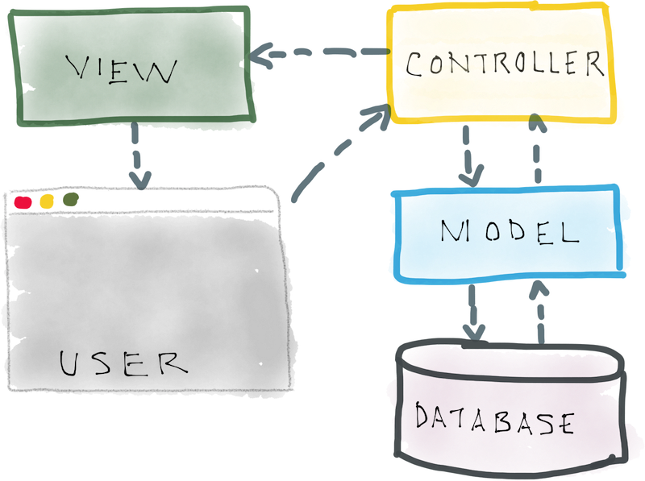

Este artigo é uma introdução informal ao Twig Template Engine para PHP. O objetivo do template é ajudar na organização
e legibilidade de seu código. Eu não quero convencê-lo de que o Twig seja lido e maravilho. Não, muito pelo contrário!

Quero destacar alguns pontos que penso (acho) serem os motivadores que justificam o uso da ferramenta. Não é uma lista
completa, até porque não quero me algonar nessa questão, mas espero dar um perspectiva de como é a ferramenta.

Dúvido muito que só com estes exemplos alguém consiga decidir se usa ou não a ferramenta, infelizmente você terá que 
botar a mão na massa, se sujar um pouco e, dessa forma, poder decidir se vale apena ou não investir a ferramenta em seus
projetos. 


## A linha divisória de sua view (visão)

Um template engine ajudará você a delinear os limites entre seus controller e suas views. Em outras palavras, eu poderia
perguntar a você: onde começa e onde termina a sua view ? O template deve ajudar a responder essa questão.

E talvez você me pergunte: é importante delimitar as fronteiras ? Sim, porque ao bater os olhos em seu código devemos
ter claro as responsabilidades de cada peça que constitui seu aplicativo, deveria ser algo bem intuitivo.




Em um sistema MVC (model, view e controller) temos, habitualmente, a seguinte estrutura de arquivos...

    /app
        controllers/
            index.php
        views/
            index.php

No caso de um aplicação PHP em que não há routers (roteamento das requisições) iremos acessar o script da seguinte forma:

    https://localhost/projetos/app/controllers/index.php

Esse será nosso controller, ele é o resonsável por receber a requisição. Na sequencia, ele (o controller) pode acessar 
alguns models (modelos) e, geralemente, termina por exibir os dados em uma view (visão).

Veja abaixo, em um exemplo hipotético, como fica bem delineado onde começa e onde termina seu controlador e sua visão.

```php
<?php

#
# Controller
#
$user = new User($_GET['id']);
$products = $users->products();


#
# View
#
echo $twig->render('views/index.html', array(
    'user'    => $user,
    'product' => $product
));
```

O leitor atento já percebeu que faltou ilustrar o código do arquivo `views/index.html`, como o exemplo poderia ser
o bastante variado eu preferi deixar essa tarefa para o próximo tópico.


## Melhor aproveitamento de HTML

__Com um engine template você economizará em código HTML__. Essa afirmação é baseada em uma experiência pessoal minha, 
exponho ela para trazer um ponto de vista um pouco diferente do apresentado no tópico anterior (sobre views e 
controllers). É que nem sempre seu objetivo será o MVC (model, view e controller), em alguns casos você simplesmente
irá querer reaproveitar melhor o uso do HTML, é o caso das mini aplicações. Nesse cenário, talvez o template lhe servia 
muito bem. Sabe aquelas sub aplicações que a gente cria para gerenciar certa parte de um aplicativo maior ? 
Não, não me refiro a área do `admin/`, pois ele normalmente é tão grande quanto a própria alicação. Me refiro a 
subsistemas mesmo, pequenos sistemas. Bom, você terá que experimentar por conta própria e, obviamente, chegar na sua 
própria conclusão.


## Herança

Decerto, a herança é aspecto que mais me motiva a utilizar os template engines. Você começa definindo um script básico,
normalmente chamam-no de `base.html`. Dentro dele estabelecemos os blocos com a tag 
`` onde
`foo` é um nome qualquer. Esse blocos serão sobrescritos pelo escript que extender a "base".

```php
<!DOCTYPE html>
<html>
    <head>
        
    </head>
    <body>
        <div id="content"></div>
        <div id="footer"></div>
    </body>
</html>
```

Veja abaixo um script fazendo uso da tag `extends` e, por consequencia, extendendo nosso exemplo acima apresentado.

Olhe bem para o exemplo abaixo, assim será a cara (a forma) como seus templates se apresentarão, o que achou ?

```php



    <title>Index</title>
    <style type="text/css">
        .important { color: #336699; }
    </style>



    <h1>Index</h1>
    <p class="important">
        Welcome to my awesome homepage.
    </p>



    &copy; Copyright 2011 by <a href="http://domain.invalid/">you</a>.

```


## Comparando PHP vs Twig 

Abaixo eu faço comparações entre a versão PHP pura e a versão Twig para que você possa ter uma perspectiva do uso do 
template.

-   __echo__

    Em PHP...

    ```php
    <p><?php echo $var ?></p>
    ```

    Com Twig...

    ```php
    <p>{{ var }}</p>
    ```

-   __Estrutura de decisão__

    Em PHP...

    ```php
    <?php if($var): ?>
        <p>true</p>
    <?php else: ?>
        <p>false</p>
    <?php endif; ?>
    ```

    Com Twig...

    ```php
    
        <p>true</p>
    
        <p>false</p>
    
    ```

-   __Laço de Repetição__

    Em PHP...

    ```php
    <h1>Members</h1>
    <ul>
        <?php foreach($users as $user): ?>
            <li><?php echo $user['username'] ?></li>
        <?php endfor; ?>
    </ul>
    ```

    Com Twig...

    ```php
    <h1>Members</h1>
    <ul>
        
            <li>{{ user.username }}</li>
        
    </ul>
    ```

-   __Datas__

    Em PHP...

    ```php
    <?php
    date_default_timezone_set('America/Sao_Paulo');
    echo (new \DateTime())->format('d/m/Y H:i');
    ```
    Com Twig...

    ```php
    {{ "now"|date('d/m/Y H:i', timezone="America/Sao_Paulo") }}
    ```


## Exercícios

1. Se habitue com a documentação Oficial [twig.symfony.com/doc/](https://twig.symfony.com/doc/2.x/)
2. Percebeu os 3 elementos principais ? Tags, filters e functions ?
3. Corra para o próximo artigo!