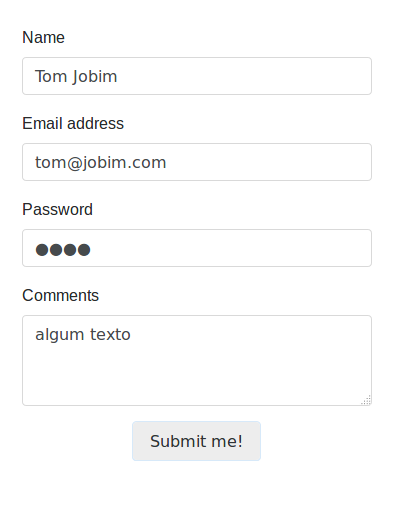

Entender o funcionamento de um formulário web é fundamental para desenvolvermos qualquer tipo de aplicação web.

O formulário é composto por tags HTML, por tanto, para o bom entendimento deste artigo, eu imagino que você já conheça
o mínimo sobre HTML e como compor um formulário.

O comportamento do formulário, de suas propriedades `action` e `method`, bem como seus campos é o objeto de estudo deste artigo.

O formulário abaixo servirá de exemplo para este artigo.

Você pode ver uma [demo](/php/labs/textbox/form.php) funcionando.



Sendo os nomes dos campos `author`, `email`, `pass` e `comments`, se clicarmos no botão "Submit", o que será enviado 
para o servidor?

Temos 4 campos.

    2 campos de texto (textbox ou `input=text`)
    1 campo de password (`input=password`)
    1 campo de texto multilinha (`<textarea>`)

Já estudamos sobre esses controles na matéria [Formulários web e seus controles](/html-css/formularios/).

Esses 3 controles são semelhantes quanto ao que acontece por trás dos panos (lá no lado do servidor). E eles são os mais
simples para se trabalhar, isso é válido tanto para __PHP__ como para [JavaScript](/javascript/).


### Propriedade name

O PHP depende desta propriedade HTML:

    <input type="" name="nome-do-campo" value="" />

Se ela não estiver preenchida, o PHP simplesmente não saberá nada sobre ela.

O nome que atribuímos para esta propriedade será o valor da chave do array global `$_POST` (se for enviado via método 
post) ou `$_GET` (se for enviado via método get).

    $_POST['nome-do-campo']

ou...

    $_GET['nome-do-campo']


Recebendo o formulário web
---

Ainda não respondemos a pergunta: o que é enviado para o servidor?

Irá a seguinte lista de campos:

- author
- email
- pass
- comments

Se enviarmos via post, a variável global será como o exemplo abaixo.

    $_POST = array(
        "author"   => ""
        "email"    => ""
        "pass"     => ""
        "comments" => ""
    )

E poderá ser acessado da seguinte forma.

    $_POST["author"];
    $_POST["email"];
    $_POST["pass"];
    $_POST["comments"];

E procuramos receber tudo no início do script, veja:

    $_POST['author']   = ( isset($_POST['author']) )   ? $_POST['author']   : null;
    $_POST['email']    = ( isset($_POST['email']) )    ? $_POST['email']    : null;
    $_POST['pass']     = ( isset($_POST['pass']) )     ? $_POST['pass']     : null;
    $_POST['comments'] = ( isset($_POST['comments']) ) ? $_POST['comments'] : null;

__E agora o que fazer com os dados?__

Aí entra a lógica de sua aplicação, em outras palavras, entra as regras de negócios de seu sistema.

Fora as regras de negócios, ainda podemos discutir sobre algumas estratégias. Por exemplo, qual será o fluxo dos dados, 
se ele vai do `script form.php` para o script `form-action.php` ou se ele vai fazer uma requisição para ele próprio e etc...

Há uma centena de possibilidades, mas abordaremos isso em outra matéria, ok?

Nosso arquivo `form-action.php` terá o seguinte conteúdo...

```php
<?php

$_POST['author']   = ( isset($_POST['author']) )    $_POST['author']    : null;
$_POST['email']    = ( isset($_POST['email']) )    ? $_POST['email']    : null;
$_POST['pass']     = ( isset($_POST['pass']) )     ? $_POST['pass']     : null;
$_POST['comments'] = ( isset($_POST['comments']) ) ? $_POST['comments'] : null;

# Visualizando os dados
var_dump($_POST);

# Apartir deste ponto, entra em cena a lógica de seu programa.
# Em outras palavras, é o que faremos com os dados recebidos.
```


Carregando o formulário web
---

Em muito casos queremos abrir o formulário já com alguns dados, quer dizer, estamos carregando o formulário.

Agora usaremos a propriedade `value=""`.


Os dados que colocarmos neste propriedade será exibido no controle do formulário faça o teste.

Escrevemos os dados na propriedade `value` como o código seguinte:

    <input type="" name="nome-do-campo" value="<?php echo $valor; ?>" />

O __controle textarea__ utilizaremos de forma diferente, escreveremos os dados entre as tags `textarea`, veja:

    <textarea><?php echo $valor; ?></textarea>
    
Então nosso formulário (arquivo `form.php`) ficará da seguinte forma:

```php
<?php

# Aqui teríamos algum código para recuperar de uma fonte de dados
# as informações do formulário.
#
# Utilizaremos o código abaixo, apenas como fins ilustrativo,
# imaginando que ele vem de alguma fonte.
$author   = "Tom Jobim";
$email    = "tom@jobim.com";
$pass     = "1234";
$comments = "algum texto";

?>
<!DOCTYPE html>
<html lang="pt-br">
    <head>
        <title>Exemplo devfuria</title>
        <meta http-equiv="Content-Type" content="text/html; charset=utf-8" />
    </head>
    <body>

        <form id="comments_form" action="form-action.php" method="post">
            <p>
                <label for="author">Name: <em class="required">(Required)</em></label>
                <input name="author" id="author" type="text" value="<?php echo $author; ?>" />
            </p>
            <p>
                <label for="email">Email Address:</label>
                <input name="email" id="email" type="text" value="<?php echo $email; ?>" />
            </p>
            <p>
                <label for="pass">Password:</label>
                <input name="pass" id="pass" type="password" value="<?php echo $pass; ?>" />
            </p>
            <p>
                <label for="text">Message: <em class="required">(Required)</em></label>
                <textarea name="text" id="text" cols="20" rows="10"><?php echo $text; ?></textarea>
            </p>
            <p>
              <input type="submit" value="Submit!" />
            </p>            
        </form>

    </body>
</html>
```

Veja aqui um [lab](/php/labs/textbox/) utilizando Bootstrap4.
