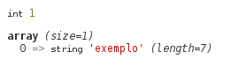

Vamos utilizar o seguinte exemplo...

    "Casa com a palavra exemplo"

Queremos encontrar a string:

    "exemplo"

Esse exemplo é tão simples que talvez você esteja se perguntando:

Porque não utilizar uma função qualquer para encontra a string?

Sim claro, você tem toda razão! O exemplo é simples, mas é só para fins ilustrativos.

A função preg_match() aceita 5 parâmetros, sendo os dois primeiros obrigatórios.

1. O primeiro parâmetro é a expressão regular (`$pattern`).
2. O segundo parâmetro é a string onde pesquisaremos a expressão (`$subject`).
3. O terceiro parâmetro é um array que armazenará o termo que casou (`$matches`).

Veja um exemplo:

```php
<?php
$pattern = "/exemplo/";
$subject = "Casa com a palavra exemplo";
$matches = array();

# Executa nossa expressão
$resultado = preg_match($pattern, $subject, $matches);
var_dump($resultado, $matches);
?>
```

...veja o resultado do `var_dump($resultado, $matches);` :



A função retorna um valor para sabermos se obtivemos sucesso ou não e, no caso do sucesso, podemos saber qual a parte
que casou.

Você deve estar pensando que pelo fato de `$matches`ser um array, poderá conter vários resultados? Errado, para obter
vários resultados (quando nossa pesquisa traz vários resultados) devemos utilizar a função 
[preg\_match\_all()](/php/preg-match-all/ "Referencia a função preg match all").

Se a expressão não casar
---

Executando o seguinte código:

```php
<?php
$pattern = "/não existe/";
$subject = "Casa com a palavra exemplo";
$matches = array();

# Executa nossa expressão
$resultado = preg_match($pattern, $subject, $matches);
var_dump($resultado, $matches);
?>
```


...recebemos um 0 (zero) na variável `$resultado` e um array vazio na variável `$matches`.

Isso significa que a função retorna 1 caso a expressão case e 0 (zero) caso NÂO case.


Se a expressão estiver sintáticamente errada
---

Se executarmos o código abaixo, ele falhará. Eu coloquei um `(` a mais.

```php
<?php
$pattern = "/(exemplo/";
$subject = "Casa com a palavra exemplo";
$matches = array();

# Executa nossa expressão
$resultado = preg_match($pattern, $subject, $matches);
?>
```

A variável `$resultado` será igual a false e receberemos um __warning__ dizendo que a compilação da expressão falhou 
(outros tipos de erros também aparecem):


Precisamos tratar o erro adequadamente (tudo bem, warning não é erro, mas não deixa de ser um aviso importante), porém
por enquanto não vamos nos preocupar com isso.


Exemplo com preg_match()
---

Sabendo como a função se comporta, podemos esboçar nossa lógica da seguinte forma:

    se o valor é igual a 1 então
        print "casou"
    se o valor é igual a 0 então
        print "não casou"
    se o valor é igual a false então
        print "ocorreu um erro"

E aí fica fácil escrevermos o código final.

```javascript
<?php
$pattern = "/exemplo/";
$subject = "Casa com a palavra exemplo";
$matches = array();

// Executa nossa expressão
$resultado = preg_match($pattern, $subject, $matches);

if ($resultado === 1) {
    print "casou";
    var_dump($matches);

} else if ($resultado === 0) {
    print "não casou";
    var_dump($matches);

} else if ($resultado === false) {
    print "ocorreu um erro";

}
?>
```


- - -
Fonte

- [Manual do PHP - preg_match()](http://php.net/manual/en/function.preg-match.php)