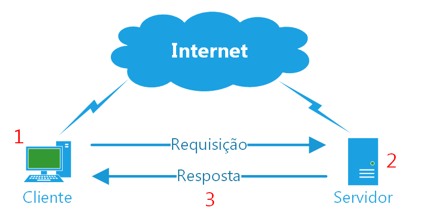
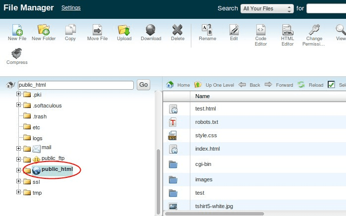
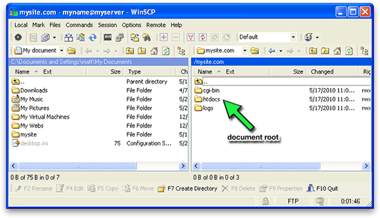
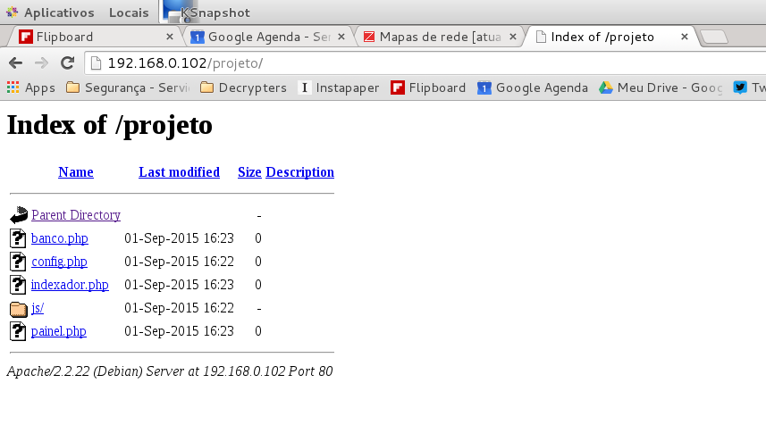

> O PHP é uma linguagem popular de script (scripting language) de propósito geral que é especialmente adequada para
> desenvolvimento web. Rápido, flexível e pragmático, o PHP pode fazer tudo, desde um blog até os sites mais populares
> do mundo.
>
> [Fonte: php.net](http://www.php.net/)

PHP é uma linguagem de programação para uso geral.

Inicialmente, projetada por [Rasmus Lerdorf](http://pt.wikipedia.org/wiki/Rasmus_Lerdorf) na década de
1990, tinha como objetivo principal contar as visitas que eram realizadas em seu currículo on-line.  Hoje (quase 20 anos
depois, estrou [re]escrevendo este artigo em julho/2017) ainda é isso o que fazemos com PHP, alteramos o  HTML de forma
dinâmica lá no lado do servidor. À primeira vista, pode parecer algo simples e até estúpido, mas é assim que é, e posso
garatir a você, é uma terafa desafiadora. Com o tempo, você descobrirá que ele pode fazer muito mais do que alterar HTML
(rss), poderá fazer API's consistentes e que trabalham com JSON, por exemplo.

O PHP atua junto com um servidor web, esse último é alguém que foi programado para escutar requisições HTTP e devolver
algum tipo de resposta. Fazendo o papel de cliente, temos o browser, o seu navegador web! Ele é um softwarer que faz
requisições web.



É esse o fluxo (à grosso modo) de um modelo cliente/servidor.

Tente fixar essa imagem em sua memória.


## Hello World com PHP

Você pode abrir um editor de texto qualquer e criar um arquivo chamado `index.php`.

Tenha a certeza de não ter nada escrito neste arquivo.

Agora, adivinha o que faz esse script ? Nada, absolutamente nada. Seu script será interpretado como se fosse um arquivo
HTML, a única coisa que lembra que ele é um script é sua extensão `.php`.

```php
# index.php


```

A primeira coisa que você deve fazer é inserir a tag inicial de php `<?php`. E sim, temos a tag de fechamento `?>`, mas
não é necessário utilizá-la caso o conteúdo seja inteiro de php, veja exemplo abaixo.

```php
<?php


```

Agora seu arquivo se parece com um script php (rssss). Vamos dar vida a ele ?

A função [echo](https://secure.php.net/manual/pt_BR/function.echo.php) exibe uma string. As strings são representadas e
envolvidas por aspas duplas ou simples.

Ao final de cada linha, temos o símbolo `;`

```php
<?php

echo "Oi, eu sou o PHP!";

```

Esse foi nosso "hello world".

Se você tivesse um servidor web devidamente instalado e, junto com ele, o PHP também instalado, você poderia executar
esse script. Você abre seu navegador e aciona a URL `http://localhost/index.php`.

```
http      - este é o protocolo
://       - isso é, bem isso é uma chatisse
localhost - ele procura no host local, sacou ?
index.php - esse é o nome de seu script
```
Veremos como instalar o ambiente nos próximos artigos, por enquanto é importante você entender melhor o processo.


## Hello world no terminal

Não é só através de um navegador que executamos um script php, podemos fazer isso através do terminal.

Quem usa Linux, já deve estar familiarizado com o terminal e quem usa Windows, não tem desculpa não, pois você pode
usar o Power Shell, no terminal execute:

    php index.php

Aliás, no terminal, podemos acionar o servidor do php que vem embutido com alinguagem (disponível na versão 7).

    php -s index.php

Você conseguirá abrir a URL `http://127.0.0.1/index.php:8000`.

Mas, por hora, vamos tentar entender o processo.


## Você precisa entender o processo

Um domínio, por exemplo `devfuria.com.br`, está configurado para apontar para determinado servidor. Neste referido
servidor, temos nossa estrutura de diretórios. Uma pasta muito importante é a raiz de documento (documentroot), o nome
dessa pasta normalmente é `public_html` ou `htdocs`.






Dentro de nosso documentroot temos uma infinidade de scripts que respondem pelas requisções, eles são arquivos de texto
simples salvos com a extensão `.php`. Dentro de uma pasta, o script padrão executado será o de nome `index`, veja figura
abaixo.


Em outras palavras, o servidor irá procurar por esse nome, se ele achar, executa, se não achar ele listará o diretório,
veja figura abaixo. O programador mudou o nome do arquivo para `indexador.php`, portanto, o servidor não soube que script
executar e resolveu mostrar (listar) os arquivos contidos na pasta.




Continuando, vamos imaginar que o domínio `dev.opera.com` está apontando para o número IP 213.236.208.98. Quando você
abrir seu navegador e digitar a URL `dev.opera.com` ele irá fazer uma requisição através do protocolo HTTP para
o número do IP mencionado, vai percorrer dividido em pacotes por um "caminho maluco" chamado INTERNET (peça para uma cara
de "redes' explicar esse negócio à você) e finalmente, vai bater no servidor. Este, encontrando o resultado, devolve
para o cliente o HTML com o código de resposta 200 (página encontrada). Estamos ainda nos referindo sobre o modelo
cliente/servidor e sobre requisições e respostas (requests and responses). Veja a imagem abaixo.


## Exercício

Abra um editor de texto qualquer e crie um arquivo PHP que faça alguma coisa, nem que seja um "hello world".

## Desafios

1. Releia o artigo e me diz qual foi a sua dúvida nos comentários abaixo.
2. Procure na web por cada um dos itens abaixo que você desconhece...
    - modelo cliente-servidor
    - protocolo HTTP
    - códigos de resposta do protocolo HTTP (200, 404, 500, 501, etc...)
    - requisições (requests) HTTP
    - respostas (responses) HTTP
    - servidor web
    - documentroot
    - script
    - domínio (para web)
    - URL
    - script
3. Descubra quais são os servidores web disponível e anote qual é a  última versão. Você não vai querer instalar uma
versão que não seja a mais atual, vai?


## Olha o que eu selecionei para vc

- [O que é o PHP?](https://secure.php.net/manual/pt_BR/intro-whatis.php)
- [O que o PHP pode fazer?](https://secure.php.net/manual/pt_BR/intro-whatcando.php)
- [Um simples tutorial](https://secure.php.net/manual/pt_BR/tutorial.php)
- [wikipedia - PHP](https://pt.wikipedia.org/wiki/PHP)
- [Vídeos no YouTube sobre a história do PHP](https://www.youtube.com/results?search_query=hist%C3%B3ria+do+php)
