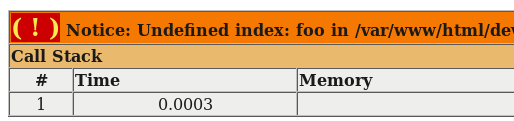

`$_GET` e `$_POST` são variáveis globais, você poderá utilizá-las em qualquer parte do código.

Adivinha quando você usa uma ou outra?

Quando a requisição for GET usaremos `$_GET`.

Quando a requisição for POST usaremos `$_POST`.

Ambas são do tipo [array](/php/criando-e-iterando-um-array/).

Podemos ver o resultado  das variáveis da seguinte forma:

    var_dump($_GET, $_POST);

A requisição acontece com um grupo de pares `nome=valor`.

Se a requisição fosse via POST, teriamos:

    $_POST['nome'] = valor

e se fosse via GET teríamos:

    $_GET['nome'] = valor

Tudo igual, certo ? Certíssimo! A única mudança é na variável global, ou `$_GET` ou `$_POST`.


## Quando a key(chave) não existe


Quando executamos o script abaixo sem os devidos paramêtros...

```php
<?php
echo $_GET['foo'];
?>
```

...recebemos um erro:



E aí, já sabe identificar o erro? O indice do array não foi definido (Undefined Index). Quer dizer, estamos querendo
utilizar um índice de um array que ainda não foi definido (inicializado).

Na verdade não é um erro e sim um `notice`. Em PHP temos erros fatais (error), notices e warnings, mas isso é outro assunto.


## Checando se o valor "chegou" ou não com isset()


A função `isset()` nos diz se determinada variável foi inicializada ("setada").

Traduzindo "is set" ao pé da letra (tradução tupiniquim) seria "está setado" ou melhor "foi inicializado".

A função testa variáveis e também chaves associativas de [array](/php/criando-e-iterando-um-array/), então podemos utilizá-la
da seguinte forma:

    if(isset($_POST['foo'])) {
        echo $_POST['foo'];
    }

Prejuízos: uma linha de código virou 3 e, ligeiramente, menos legível.

Um programador "espertinho" faria isso:

    if(isset($_POST['foo'])) { echo $_POST['foo']; }

Voltamos a 1 única linha, mas a acabamos com a legibilidade. Bom, será que com o operador ternário ficaria melhor ?
Ou menos ruim?


## Incializando com operador ternário


Para quem não conhece, em PHP temos o operador ternário  `(expressão) ? true : false ;`.

Uma variável pode ser inicializada com o valor null, exemplo:

    $_POST['foo'] = null;
    echo $_POST['foo'];

O código acima evitaria o erro `undefined index`, mas ele não faz sentido, ele sobrescreveria o valor passado na requisição.
Então, de repente, surge a seguinte idéia:

    if(isset($_POST['foo'])) {
        # retornar o valor da variável
    } else {
        # retornar null
    }

Seria ótimo, mas agora temos 5 linhas.

Neste caso poderemos utilizar o operador ternário.

    echo ( isset($_POST['foo']) ) ? "retornar o valor da variável" : "retornar null";

Trocando as strings por código real temos:

    echo ( isset($_POST['foo']) ) ? $_POST['foo'] : null;

Voltamos a uma única linha, mas se tivermos 2 pontos ou mais teremos que repetir esse "trambolhão" aí.

E se, ao invés de dar `echo`, atribuíssemos o valor na própria variável `$_POST['foo']`?

    $_POST['foo'] = ( isset($_POST['foo']) ) ? $_POST['foo'] : null;

Perfeito! Agora podemos dar `echo` à vontade.

O código final ficou assim:

```php
$_POST['foo'] = ( isset($_POST['foo']) ) ? $_POST['foo'] : null;
echo $_POST['foo'];
```


Então podemos combinar o seguinte: no começo do script recebemos os dados e ficamos tranquilo para utilizar no restante
do script, veja:

```php
<?php

#
# Recebemos os dados no começo do script
#
$_POST['laranja'] = ( isset($_POST['laranja']) ) ? $_POST['laranja'] : null;
$_POST['banana']  = ( isset($_POST['banana']) )  ? $_POST['banana']  : null;
$_POST['pera']    = ( isset($_POST['pera']) )    ? $_POST['pera']    : null;
$_POST['abacaxi'] = ( isset($_POST['abacaxi']) ) ? $_POST['abacaxi'] : null;

#
# Apartir deste ponto podemos utilizar o array sem medo
#
echo $_POST['laranja'];
echo $_POST['banana'];
echo $_POST['pera'];
echo $_POST['abacaxi'];
```

Economizamos algumas linhas sem prejudicar a legibilidade do código.


## Duplicando as variáveis


A forma abaixo já foi muito usual:

```php
<?php

#
# Recebemos os dados no começo do script
#
$laranja = ( isset($_POST['laranja']) ) ? $_POST['laranja'] : null;
$banana  = ( isset($_POST['banana']) )  ? $_POST['banana']  : null;
$pera    = ( isset($_POST['pera']) )    ? $_POST['pera']    : null;
$abacaxi = ( isset($_POST['abacaxi']) ) ? $_POST['abacaxi'] : null;

#
# Apartir deste ponto podemos utilizar as variáveis sem medo
#
echo $laranja;
echo $banana;
echo $pera;
echo $abacaxi;
```

Mas ele duplica as variáveis.

O sabor da laranja está tanto em `$_POST['laranja']` como em `$laranja`.

    echo $_POST['laranja'];
    echo $laranja

Se, duplicar variáveis não for um problema para você, então para mim também não é.


## Exercícios

1) Você leu os artigos anteriores ?

2) Experimente os exemplos aqui demonstrados em sua própria máquina, veja a coisa funcionando com seus próprios olhos.

3) Modifique os exemplos para receber mais variáveis e perceba, conforme o número de variáveis cresce, como o seu código
fica menos passível de manutenção (de difícil manutenção).


