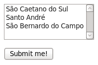

Ao adicionar-mos a propriedade `multiple` ao controle `select` obtemos uma caixa de seleção de multipla escolha.

Nesta caixa podemos selecionar 0 (zero), uma ou mais opções.


<!DOCTYPE html>
<html lang="pt-br">
    <head>
        <title>Formulário: combobox</title>
        <meta charset="utf-8">
    </head>
    <body>

        <form action="form-action.php" method="post">
            

                <select multiple name="cidades[]">
                    <option value="scs">São Caetano do Sul</option>
                    <option value="sa">Santo André</option>
                    <option value="sbc">São Bernardo do Campo</option>
                </select>
            

            

                <input type="submit" value="Submit me!" />
            

        </form>

    </body>
</html>


Por se tratar de um controle do tipo __combobox__ podemos dizer que o que é válido para o controle...

<select>

também é valido para o controle...

<select multiple>

Talvez você queria fazer uma pausa e ver a matéria sobre o controle combobox ([Manipulando combobox com PHP]()).

Continuando...o único detalhe que merece atenção é a propriedade `name`, ela foi acrescida dos sinais `[]`.

Sem os colchetes, o servidor não entenderia que estamos enviando multiplos valores. 

Ele interpretará como somente 1(um) par valor `cidade="apenas-uma-cidade"` e não múltiplos.

Com os colchetes, o servidor entenderá os dados como um array, ex: a`rray("sa", "sbc")`.

Recebendo o formulário web
---

O controle enviará todas as opções que o usário escolher no array `$_POST['cidades']`.

Sendo um array, podemos então percorrê-lo com um `foreach`.


<?php
# Inicializando a variável $_POST['cidades']
$_POST['cidades'] = isset($_POST['cidades']) ? $_POST['cidades'] : null;

# Se tivermos a variável...
if ($_POST['cidades']) {

    foreach ($_POST['cidades'] as $cadaCidade) {
        echo "armazenar '$cadaCidade'  ";
    }

} else {

    echo "usuário não escolheu nada ('null')";

}


Carregando o formulário web
---

Para carregar o formulário basta percorrer o array e "printar" as "options".


<?php foreach ($arrCombo as $key => $value): ?>
    <?php echo "<option value=\"$key\"  $selected>$value</option>"; ?>
<?php endforeach; ?>


Mas queremos marcar as "options" segundo os valores selecionados.

Os valores selecionados seriam um array como o abaixo, lembrando que ele seria dinâmico e não estático como em nosso exemplo.


<?php
$valores_selecionados = array (
   "scs",
   "sbc"
);


O "pulo do gato" é, dentro do laço, perguntar se a chave `$key` está contida no array `$valores_selecionados`.

Fazemos isso com a função `in_array()`.

O código abaixo retornará true caso encontre a `$key` dentro do array `$valores_selecionados`.


<?php
(in_array($key, $valores_selecionados)) ? "selected=\"selected\"" : null; 



<?php

# Array com os dados de nossa combo
$arrCombo = array (
    "scs" => "São Caetano do Sul",
    "sa" => "Santo André",
    "sbc" => "São Bernardo do Campo"
);

# Array com os os valores que devem ser selecionados
$valores_selecionados = array (
   "scs",
   "sbc"
);

?>
<!DOCTYPE html>
<html lang="pt-br">
    <head>
        <title>Formulário: combobox</title>
        <meta charset="utf-8">
    </head>
    <body>

        <form action="form-action.php" method="post">
            

                <select multiple name="cidades[]">
                    <?php foreach ($arrCombo as $key => $value): ?>
                        <?php $selected = (in_array($key, $valores_selecionados)) ? "selected=\"selected\"" : null; ?>
                        <?php echo "<option value=\"$key\"  $selected>$value</option>"; ?>
                    <?php endforeach; ?>
                </select>
            

            

                <input type="submit" value="Submit me!" />
            

        </form>

    </body>
</html>
