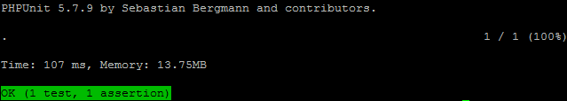
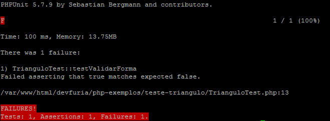

## Variáveis

As variáveis no PHP são representadas por um cifrão ($) seguido pelo nome da variável, os nomes de variável são
case-sensitive.

```php
<?php
$nome  = "Joana Gabrielle";
$idade = 5;

echo $nome;       # Joana Gabrielle
echo "\n";        # '\n' é uma quebra de linha
echo $idade + 1;  # 6
```


## Examinando o valor de uma variável

Para examinarmos o conteúdo de uma variável podemos utilizar a função `print_r()`.

```php
<?php
print_r($minha_variavel);
```

Mas você irá notar que ainda não está legível como você gostaria, então tente incluir umas tags HTML:

```php
<?php
echo "<pre>";
print_r($minha_variavel);
echo "</pre>";
```

Aí sim você verá o resultado bem formatado. Mas tudo isso de linha só para exibir o valor de uma variável ?
Você pode utilizar uma função, por exemplo:

```php
<?php
function my_print_r($minha_variavel) {
    echo "<pre>";
    print_r($minha_variavel);
    echo "</pre>";
}
```

... ou utilizar o `var_dump()`. Háaaaa, então porque você não me apresentou logo esse cara ? É porque o `print_r()` é uma
função interna, ela acompanha o PHP. O `var_dump()` também é uma função interna, mas para ele funcionar (adequadamente)
você precisará ter a extensão [x-debug]() devidamente instalado.

```php
<?php
var_dump($minha_variavel);
```

- var_dump: exibe tipo e valor, precisa ter o `x-debug instalado
- print_r: exibe valor, fica melhor com a tag `<pre>`

Talvez você queira dar uma olha neste artigo [Debugando código em PHP ](/php/debugando-codigo/)


## Funções

Funções são uma seção nomeada de código, um pequeno (normalmente pequeno) trecho de código que pode ser chamado de diversos ponto do código.

Quando o programador precisar executar um mesmo código várias vezes, ele poderá utilizar-se de funções.

As funções introduzem o conceito de reusabilidade, ou seja, "escrever código para depois".

```php
<?php
function somar_dois_numeros($param1, $param2) {
    return $param1 + $param2;
}

echo somar_dois_numeros(5, 3);
```

Leia mais sobre [funções](/php/funcoes/).


## Operadores Aritiméticos

```php
<?php
$a + $b;    # Adição         : Soma de $a e $b.
$a - $b;    # Subtração      : Diferença entre $a e $b.
$a * $b;    # Multiplicação  : Produto de $a e $b.
$a / $b;    # Divisão        : Quociente de $a e $b.
$a % $b;    # Módulo         : Resto de $a dividido por $b.
$a ** $b;   # Exponencial    : Resultado de $a elevado a $b.
```

Estes operadores funcionam exatamente como o da aritmética básica da escola.

Talvez você queira ver a precedência dos operadores [php.net/Precedência de Operadores](http://php.net/manual/pt_BR/language.operators.precedence.php)


## Operadores de Incremento/Decremento

```php
<?php
++$a;       # Pré-incremento - Incrementa $a em um, e então retorna $a.
$a++;       # Pós-incremento - Retorna $a, e então incrementa $a em um.
--$a;       # Pré-decremento - Decrementa $a em um, e então retorna $a.
$a--;       # Pós-decremento - Retorna $a, e então decrementa $a em um.
```


## Operadores Lógicos

```php
<?php
($a && $b);  # verdadeiro se $a e $b forem verdadeiros.
($a || $b);  # verdadeiro se $a ou $b forem verdadeiros.
($a xor $b); # verdadeiro se $a ou $b forem verdadeiros, mas se ambos forem verdadeiro, então é falso.
```


## Como comentar o código

Duas barras comentam o código linha a linha.

```php
<?php
// comentários
```

O sinal de sharp também comenta linha a linha.

```php
<?php
# comentários
```

Outra forma de comentar linha a linha.

```php
<?php
/* comentários */
```

Mas também podem ser usado para várias linhas.

```php
<?php
/*

comentários
comentários
comentários

*/
```

Este é um exemplo de comentários do tipo dock block, alguns editores ajudam a criar esse bloco, você digita `/**`,
preciona a tecla "Enter" e o editor completa a estrutra desse comentário.

```php
<?php
/**
 * Comentário do tipo DocBlock
 *
 * comentários
 * comentários
 * comentários
 */
```

Abaixo vemos um alternativa simplificada.

```php
<?php
#
# alternativa
#
```


## Estruturas de controle

Bloco if-else.

```php
<?php
if (expressao-condicional) {
    ... executar codigo
    ... executar codigo
    ... executar codigo
} else {
    ... executar codigo
    ... executar codigo
    ... executar codigo
}
```

Bloco if-elseif-else

```php
<?php
if (expressao-condicional) {
    ... executar codigo
    ... executar codigo
    ... executar codigo
} else if (expressao-condicional) {
    ... executar codigo
    ... executar codigo
    ... executar codigo
} else
    ... executar codigo
    ... executar codigo
    ... executar codigo
}
```

Operador ternário

```php
<?php
$resultado = (expressao-condicional) ? "caso-true" : " caso-false" ;
```


## Laços de repetição

Laço `foreach()`:

```php
<?php
foreach(['primeiro', 'segundo', 'terceiro'] as $value) {
    echo $value;
}
// Exibe... 'primeiro', 'segundo' e 'terceiro'
```

Laço `for()`:

```php
<?php
for($i = 0; $i < 5, $i++){
    echo $i;
}
// exibe 0, 1, 2, 3, e 4
```

Laço `while()`:

```php
<?php
$i = 0;
while ($i > 5) {
    echo $i;
    $i++;
}
// exibe 0, 1, 2, 3, e 4
```


## Requisição de arquivos

Para incluir outros scripts em seu scritp atual você pode utilizar o `include` ou `require`.

O `include` inclui um arquivo sem se preocupar se o arquivo existe ou não.

O `require` inclui um arquivo e lançará um erro se ele não existir, por tanto, ele é requerido, exigido!

O complemento `_once` significa que o script deve ser inserido uma única vez, ou seja, se você chamar um script que
chama outros scripts, e estes, por sua vez, chamam a si mesmo, então você receberá um erro. Um errro por que o script
foi inserido duas vezes ? Não, mas imagine que temos uma função chamada `foo()`, quando o mesmo script for chamado pela
segunda vez, ele reclamará que não pode redefinir `foo()`.


```php
<?php
include "arquivo.php";       # inclui o arquivo
include_once "arquivo.php";  # inclui o arquivo uma única vez
require "arquivo.php";       # requer um arquivo
require_once "arquivo.php";  # requer um arquivo uma única vez
```
Tanto `include` como `require` são funções, alguns desenvolvedores preferem a forma de função, veja:

```php
<?php
require('arquivo.php');
```

Sim, mas e agora qual eu devo usar ?

Use o `require_once`, ele é o mais restritivo e o mais utilizado também.


## Tipos

O PHP suporta oito tipos primitivos.

- escalares:
    + boolean
    + integer
    + float
    + string
- compostos:
    + array
    + object
    + callable
- especiais:
    + resource
    + NULL

O tipo __booleano__ aceita `true` ou `false`, é case insensitive, ou seja, aceita `True`, `TRUE` ou `true`, eu gosto de
usar tudo minúsculo.

O tipo __interge__ (inteiro) é um número do conjunto Z = {..., -2, -1, 0, 1, 2, ...}.

O tipo __float__ trata-se de um número de ponto flutuante (também conhecidos como "doubles" ou "números reais"),
podem ser especificados comforme exemplo abaixo.

```php
<?php
$a = 1.234;
```

Um __resource__ (recurso) é uma variável especial, que mantém uma referência a um recurso externo, por exemplo: se
você abrir uma conexão ftp  a sua variável conterá um recurso de ftp.

O valor especial __NULL__ representa uma variável sem valor. `NULL` é o único valor possível do tipo null.

A variável é considerada null se:

1. foi atribuída a constante NULL.
2. ainda não recebeu nenhum valor.
3. foi apagada com unset().

Os demais tipos eu vou deter um pouco mais de tempo...


## Strings

Uma string pode ser especificada com aspas duplas e aspas simples.

- Aspas duplas: o conteúdo é interpretado.
- Aspas simples: o conteúdo NÂO é interpretado.


```php
<?php
$nome = "Joana";

# aspas duplas
echo "Seu nome é $nome"; // Seu nome é Joana

# aspas simples
echo 'Seu nome é $nome'; // Seu nome é $nome

```

Você pode concatenar strings com o ponto `.`

```php
<?php
# exemplo 1
echo "Joana" . "Gabrielle"; // Joana Gabrielle

# exemplo 2
$nome      = "Joana";
$sobrenome = "Gabrielle";
echo $nome . $sobrenome;    // Joana Gabrielle
```

Há outras duas formas: heredoc e nowdoc, talvez você queira ver a documentação sobre
[strings](http://php.net/manual/pt_BR/language.types.string.php).


## Arrays

Array é uma estrutura que relaciona valores e chaves, é uma lista de valores armazenados na memória.

```php
<?php
# Como se criava array antigamente
$arr = array("primeiro", "segundo", "terceiro");

# Como se cria um array atualmente
$arr = ["primeiro", "segundo", "terceiro"];
```

Veja como acessar o valor de um array.

```php
<?php
echo $arr[0]; // exibe 'primeiro'
```

O array pode ser numérico...

```php
<?php
$arr = [
    0 => "vermelha",
    1 => "doce",
    2 => "redonda",
    3 => "maçã"
];
```

...ou associativo:

```php
<?php
$arr = [
    "cor"     => "vermelha",
    "sabor"   => "doce",
    "formato" => "redonda",
    "nome"    => "maçã"
];
```

Normalmente, percorremos o array com a ajuda do `foreach`, veja:

```php
<?php
foreach($arr as $valor) {
    var_dump($valor);
}
// exibirá: "vermelha", "doce", "redonda", "maçã"
```

Leia mais sobre [arrays](/php/criando-e-iterando-um-array/).


## Objetos

Para instanciar um objeto em PHP você deve utilizar a palavra `new` seguida do nome do objeto.

É uma convenção (ou talvez uma boa prática) que o nome da classe começe com maiúsculo.

Podemos acessar as propriedades e métodos através do símbolo `->` (é parece uma seta, eu sei).

```php
<?php
# arquivo index.php

require "Triangulo.php";

$objeto = new Triangulo();               # instanciamos
$objeto->a = 3;                          # atribuímos valor
$objeto->b = 4;                          # idem
$objeto->c = 5;                          # idem
var_dump(  $objeto->validarForma()  );   # executamos um método
```

A definição de uma classe começa com a palavra chave `class`, seguida do nome da classe e de um par de colchetes `{}`.

Uma classe pode conter suas próprias constantes, variáveis (chamadas de "propriedades") e funções (chamadas de "métodos").

A pseudo-variável `$this` está disponível quando um método é chamado a partir de um contexto de objeto, `$this` é uma
referência ao objeto chamado.

```php
<?php
# arquivo Triangulo.php

class Triangulo {

    # suas propriedades
    public $a;
    public $b;
    public $c;

    # seus métodos
    public function validarForma() {
        if ($this->a < ($this->b + $this->c)) {
            if ($this->b < ($this->a + $this->c)) {
                if ($this->c < ($this->a + $this->b)) {
                    return true;
                }
            }
        }
        return false;
    }
}
```

<!-- Leia mais sobre [objetos](/php/programacao-orientada-a-objetos) -->


## Testes Unitários (ou teste de unidades)

Testes unitários ou testes de unidades (para os mais puristas) são testes que escrevemos para que sejam realizados de
uma forma automática. Desabafo: como eu queria ter sido apresentado à eles logo no começo de minha formação, deveria ser uma
matéria obrigatória em todo curso de tecnologia. Por isso eu já vou apresentando ele a você logo aqui na "sintaxe básica".

Eu sei que você, ao bater seus olhos sobre o trecho da função `validarForma()` (acima apresentada), pensou imediatamente
"como será que se valida a forma de um triângulo ?", ou ainda, "se eu passar tal valor para essas variáveis, o que será que a
função devolve?", ou melhor, "será que essa função funciona ?".

Sempre que você se deparar com um código estranho, desconhecido, feito por terceiros, principalmente código do tipo alienígina, acabará se fazendo as seguintes perguntas :


- o que esse código faz ?
- como ele funciona ?
- qual é a sua entrada ?
- qual é a sua saída ?
- ele está funcionando ?
- acabei de alterá-lo, será que continua funcionando ?

Se existir um (pelo menos um) teste escrito, basta executar e você obterá as respostas.

Escrevemos testes através das asserções, ou melhor, de um "assert function".

Devemos comparar o valor __esperado__ com o valor __atual__.

```php
<?php

#
# código
#
function somar($a, $b) {
    return $a + $b;
}

#
# um projeto inacabado de assert function
#
$expected = 10
$actual   = somar(8, 2);
if ($expected == $actual) {
    echo "green flag, seu teste passou!";
} else {
    echo "red flag, seu teste não passou!";
}
```

Um exemplo real de asserção é `assertEquals($expected, $actual)` que irá testar se duas variáveis são iguais ou não. Ela
aceita dois valores (parâmetros) que devem ser iguais. Se não forem iguais, ou seja, se o teste falhar, então veremos
um alerta de bandeira vermelha.

Para utilizar essa função você precisará de um framework de testes instaldo, além disso, teremos que ter uma certa
intimidade com o que chamamos de terminal, pois executamos os teste no terminal. Abaixo segue um exemplo escrito para
o framework de testes __PHPUnit__.


```php
<?php
# arquivo TrianguloTest.php

require "Triangulo.php";

class TrianguloTest extends \PHPUnit\Framework\TestCase {

    public function testValidarForma() {
        $objeto = new Triangulo();
        $objeto->a = 3;
        $objeto->b = 4;
        $objeto->c = 5;

        $this->assertEquals(true, $objeto->validarForma());
    }

}
```

Para executar o teste acima, no terminal digitamos:

    phpunit TrianguloTest.php

E veremos a seguinte informação:



Acima você viu a bandeira verde, seu teste deu certo, está passando. Só para ilustrar a bandeira vermelha, que indica
teste falhando e consequentemente código quebrado, eu simulei um erro `$this->assertEquals(false, $objeto->validarForma());`,
veja abaixo como é exibido no terminal.



Falaremos mais sobre testes em breve, por enquanto é só para você não dizer que não foi apresentado a eles logo no começo.


## Exercício

Se você já está com o PHP instalado, escreva um script onde você possa 'brincar' e ver funcionar cada um dos conceitos
aqui apresentados.