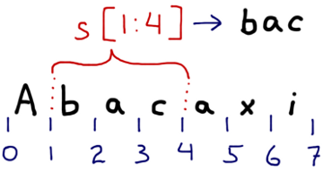

### Operações com sequências

Sequências são coleções ordenadas embutidas: strings, listas, tuplas e buffers.

<table>
    <thead>
        <tr>
            <th>Operadores</th>
            <th>Descrição</th>
        </tr>
    </thead>
    <tbody>
        <tr>
            <td><code>s[-i]</code></td>
            <td>acesso a um item pelo final</td>
        </tr>
        <tr>
            <td><code>s+z</code></td>
            <td>concatenação</td>
        </tr>
        <tr>
            <td><code>s*n n</code></td>
            <td>cópias de <code>s</code> concatenadas</td>
        </tr>
        <tr>
            <td><code>i in s</code></td>
            <td>teste de inclusão</td>
        </tr>
        <tr>
            <td><code>i not in s</code></td>
            <td>teste de inclusão negativo</td>
        </tr>
    </tbody>
</table>

### Fatiamento de sequências (slicing)

<table>
    <thead>
        <tr>
            <th>Operadores</th>
            <th>Descrição</th>
        </tr>
    </thead>
    <tbody>
        <tr>
            <td><code>s[a:b]</code></td>
            <td>cópia de <code>a</code> (inclusive) até <code>b</code>(exclusive)</td>
        </tr>
        <tr>
            <td><code>s[a:]</code></td>
            <td>cópia <code>a</code> partir de <code>a</code>(inclusive)</td>
        </tr>
        <tr>
            <td><code>s[:b]</code></td>
            <td>+ <code></code> cópia até <code>b</code>(exclusive)</td>
        </tr>
        <tr>
            <td><code>s[:]</code></td>
            <td>cópia total de <code>s</code></td>
        </tr>
        <tr>
            <td><code>s[a:b:n]</code></td>
            <td>cópia de <code>n</code> em <code>n</code>itens</td>
        </tr>
    </tbody>
</table>
 

### Atribuição em fatias:

<table>
    <thead>
        <tr>
            <th>Operadores</th>
            <th>Descrição</th>
        </tr>
    </thead>
    <tbody>
        <tr>
            <td><code>s[2:5] = [4,3,2,1]</code></td>
            <td>álida apenas em sequências mutáveis</td>
        </tr>
    </tbody>
</table>

### Funções nativas p/ sequências

<table>
    <thead>
        <tr>
            <th>Operadores</th>
            <th>Descrição</th>
        </tr>
    </thead>
    <tbody>
        <tr>
            <td><code>len(s)</code></td>
            <td>número de elementos</td>
        </tr>
        <tr>
            <td><code>min(s)</code></td>
            <td><code>max(s)</code> valores mínimo e máximo contido em <code>s</code></td>
        </tr>
        <tr>
            <td><code>sorted(s)</code></td>
            <td>devolve uma lista com itens de s em ordem ascendente <code>sorted(s, cmp=None, key=None reversed=False)</code></td>
        </tr>
        <tr>
            <td><code>reversed(s)</code></td>
            <td>retorna um iterador para percorrer os elementos do último ao primeiro</td>
        </tr>
    </tbody>
</table>

Algumas funções com strings

<table>
    <thead>
        <tr>
            <th>Operadores</th>
            <th>Descrição</th>
        </tr>
    </thead>
    <tbody>
        <tr>
            <td><code>chr(n)</code></td>
            <td>retorna uma string com um caractere de 8-bits cujo código é n</td>
        </tr>
        <tr>
            <td><code>unichr(n)</code></td>
            <td>retorna uma string com um caractere Unicode cujo código é n</td>
        </tr>
        <tr>
            <td><code>ord(c)</code></td>
            <td>retorna o código numérico do caractere c (pode ser Unicode)</td>
        </tr>
        <tr>
            <td><code>repr(x)</code></td>
            <td>conversão de objeto para sua representação explícita em Python</td>
        </tr>
        <tr>
            <td><code>len(s)</code></td>
            <td>número de bytes da string</td>
        </tr>
    </tbody>
</table>

Fonte:

- [Slide 34 de "Python: apresentando a sintaxe" (Luciano Ramalho)](https://github.com/pythonprobr/pypratico/raw/master/academia/py_sintaxe.pdf "link-externo")
