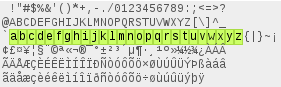
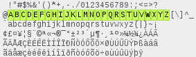
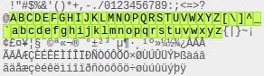
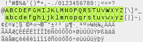
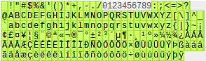
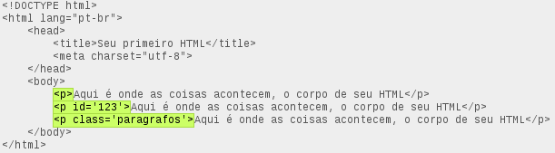

### Curinga .*

A expressão regular `.*` representada pelo "ponto" (qualquer caracter) e pelo asterisco (em qualquer quantidade) casa
com qualquer caracter em qualquer quantidade, ou seja, casa com tudo por isso é considerado um coringa.

O curinga casa com o "nada", pois "qualquer quantidade" também é igual a "nenhuma quantidade".

### Exemplos simples

A expressão regular `n.a` casa com "não", "n-o", "n5o", "n o", etc...

A expressão regular `n[ãa]o` casa com "não", "nao", etc...

A expressão regular `[-]` casa com todos os traços entre as palavras: "traços`-`entre`-`as`-`palavras"

Para incluir o literal hífen - coloque ele no final da lista, por exemplo, `[0-9-]` casa com números seguidos (ou não)
de hífens "123", "123-", "123---".

Repare que a expressão casa com qualquer quantidade e também casaria com "1-2-3-4-5".

### Números

A expressão regular `[0123456789]` casa com todos os números de um texto.

Podemos simplificar a expressão regular acima para `[0-9]`.

### Horas

A expressão regular `[0-9][0-9]:[0-9][0-9]` casa com "08:30" e "22:50". 

Mas também casa com valores que não são horas, por exemplo "99:00" e "99:99".

Já a expressão regular `[012][0-9]:[0-5][0-9]` casa com "08:30" e "22:50". 

Já melhorou um pouco, mas ainda casa com "29:00".
 

### Vogais

A expressão regular `[aeiou]` casa com as vogais, por exemplo, "`a`bcd`e`fgh`i`jklmn`o`pqrst`u`vwxyz".

### Letras

A expressão regular `[a-z]` casa com todas as minúsculas sem acentos.

É possível definir outras extensões (cumprimentos), por exemplo, a expressão regular `[a-k]` casará com as letras de
"a" a "k" "`abcdefghijk`lmnopqrstuvwxyz".

Outro exemplo é a expressão regular `[a-el-o]` que casa com o seguinte intervalo "`abcde`fghijk`lmno`pqrstuvwxyz"

A expressão regular `[A-Z]` casa com a letras maiúsculas (também sem acentos) 

Talvez você chegue na conclusão que a expressão regular `[A-z]` alcançará todas as letras, incluindo as maiúsculas e 
minúsculas. 

Mas ela vai pegar algo a mais além das letras do alfabeto.

A expressão regular `[A-Za-z]` sim, casa apenas com letras maiúscula e minúsculas.

A expressão regular `[A-Za-z0-9]` casa com os símbolos __alfa numéricos__ (números, letras maiúsculas e minúsculas)
porém todas sem acento.

O inverso é verdadeiro, como faríamos para excluir os caracteres alfa numéricos? `[^A-Za-z0-9]`.

O metacaracter ^ (circunflexo) no início de uma lista representa lista negada, ou seja, o que tiver dentro dela será
desconsiderado. 

Um exemplo é a expressão regular `[^0-9]` que representa todos os caracteres da tabela ASCII menos os 
numéricos.

### Letra com acentos (classes POSIX)

Para incluir acentos (letras acentuadas) devemos recorrer as __classes POSIX__, elas levam em conta a localidade do sistema.

<table>
    <thead>
        <tr>
            <th>classe POSIX</th>
            <th>significado</th>
            <th>equivalente</th>
        </tr>
    </thead>
    <tbody>
        <tr>
            <td>[:upper:]</td>
            <td>letras maiúsculas</td>
            <td>`[A-Z]`</td>
        </tr>
        <tr>
            <td>[:lower:]</td>
            <td>letras minúsculas</td>
            <td>`[a-z]`</td>
        </tr>
        <tr>
            <td>[:alpha:]</td>
            <td>maiúsculas e minúsculas</td>
            <td>`[A-Za-z]`</td>
        </tr>
        <tr>
            <td>[:alnum:]</td>
            <td>alfa numéricos</td>
            <td>`[A-Za-z0-9]`</td>
        </tr>
        <tr>
            <td>[:digit:]</td>
            <td>Números</td>
            <td>`[0-9]`</td>
        </tr>
    </tbody>
</table>

A correta utilização é __uma classe POSIX dentro de uma lista__:

    [[:upper:]]

### Tags HTML

A expressão regular `<p[^>]*>` pega todas as tags `p` iniciais.
					

[Fonte](http://www.mywebref.com/Code_Helper/pages/33.html)

Créditos dos exemplos
---

A maioria dos exemplos são do [Piazinho](http://www.piazinho.com.br/ed3/exemplos.html#1)