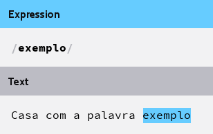
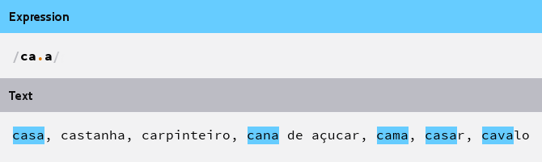

__O que são Expressões Regulares ?__

Expressões Regulares é uma técnica para procurar, de forma bem específica, um texto abrangente. Basicamente uma expressão regular é um conjunto de caracteres que define um padrão para ser procurado dentro de uma string.

A expressão regular relaciona todas as ocorrências (__matches__) de um padrão (__pattern__) em um trecho de texto
(__subject__).

<table>
    <thead>
        <tr>
            <th>termo</th>
            <th>significado</th>
        </tr>
    </thead>
    <tbody>
        <tr>
            <td>matches</td>
            <td>Casar, encontrar, combinar, ocorrências, conferir, encaixar e igualar.</td>
        </tr>
        <tr>
            <td>pattern</td>
            <td>Padrão, a expressão regular propriamente dita. String de padrão de procura.</td>
        </tr>
        <tr>
            <td>subject</td>
            <td>Texto que será vasculhado por nossa expresão regular.</td>
        </tr>
    </tbody>
</table>

Exemplos
---

O exemplo mais simples possível de uma expressão regular seria a busca pelo "termo exato":

Imagine que queremos procurar a palavra `exemplo` dentro da frase "Casa com a palavra exemplo".

O __assunto (subject)__ é "Casa com a palavra exemplo" e a __expressão regular__ é "exemplo", logo o resultado seria:

Outro exemplo, é a expressão regular `ca.a`.

O sinal `.` [ponto](../metacaractere-ponto/) é um metacaractere que representa qualquer coisa, ou melhor, qualquer caracter.

Veja os resultados (matches) da expressão abaixo:

