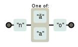

A lista casa com quem ela conhece e tem suas próprias regras.

Dentro da lista, todo mundo é normal e `-` (traço) indica intervalo.

<table>
    <thead>
        <tr>
            <th>expressão regular</th>
            <th>casa com...</th>
            <th>diagrama</th>
        </tr>
    </thead>
    <tbody>
        <tr>
            <td><code>[Tt]eclado</code></td>
            <td>teclado, Teclado</td>
            <td></td>
        </tr>
        <tr>
            <td><code>n[ãa]o</code></td>
            <td>não, nao</td>
            <td></td>
        </tr>
    </tbody>
</table>