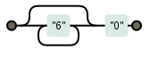
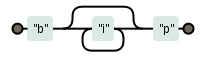
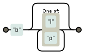

O asterisco repete em qualquer quantidade

O asterisco é um metacaractere do tipo quantificador que significa que o valor anterior a ele pode...

* ter, 
* não ter, 
* ou ter vários, infinitos.

Quer dizer, a entidade anterior pode aparecer em qualquer quantidade.

<table>
    <thead>
        <tr>
            <th>expressão regular</th>
            <th>casa com...</th>
            <th>diagrama</th>
        </tr>
    </thead>
    <tbody>
        <tr>
            <td><code>6*0</code></td>
            <td>0, 60, 660, 6660, 6666666666660</td>
            <td></td>
        </tr>
        <tr>
            <td><code>bi*p</code></td>
            <td>bp, bip, biip, biiip, biiiip...</td>
            <td></td>
        </tr>
        <tr>
            <td><code>b[ip]*</code></td>
            <td>b, bi, bip, biipp, bpipipi, biiiiip, bppp, ...</td>
            <td></td>
        </tr>
    </tbody>
</table>

