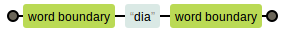
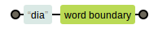
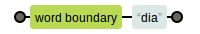

O metacaractere borda marca a borda de um "trecho" (letras, números e sublinhado).

A borda é útil para marcar palavras exatas e não parciais.

A expressão `\bdia\b` casa com a palavra inteira "dia".

Já com a parcial "dia" da palavra "diafragma" ela não casa.

<table>
    <thead>
        <tr>
            <th>expressão regular</th>
            <th>casa com...</th>
            <th>diagrama</th>
        </tr>
    </thead>
    <tbody>
        <tr>
            <td><code>\bdia\b</code></td>
            <td>
                bom-<code>dia</code>! 
                <code>dia</code>fragma 
                melodia<code>dia</code> 
            </td>
            <td></td>
        </tr>
        <tr>
            <td><code>dia\b</code></td>
            <td>
                bom-<code>dia</code>! 
                diafragma 
                melodia<code>dia</code> 
            </td>
            <td></td>
        </tr>
        <tr>
            <td><code>\bdia\b</code></td>
            <td>
                bom-<code>dia</code>! 
                <code>dia</code>fragma 
                melodiadia 
            </td>
            <td></td>
        </tr>
    </tbody>
</table>

Obs: "Boundary" significa limite, fronteira, divisão, marco, etc...