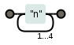

O quantificador chaves funciona como uma repetição mais controlada, onde `{n,m}` significa de `n` até `m` vezes.

A expressão `n{1,4}` casa "n", "nn", "nnn" e "nnnn" (exatamente isso; nem mais, nem menos).

Você pode especificar um número exato, um mínimo, um máximo, ou uma faixa numérica:

- `{1, 3}` de 1 a 3
- `{1, 4}` de 1 a 4
- `{3, 5}` de 3 a 5

Um valor exato assume a forma `{n}`:

- `{3}` exatamente 3
- `{5}` exatamente 5

Máximo de ocorrências `{,n}`:

- `{0,3}` no máximo 3
- `{0,5}` no máximo 5

Mínimo de ocorrências `{n,}`:

- `{3,}` no mínimo 3
- `{5,}` no mínimo 5

### Cheat sheet (nossa cola, resumo)

<table>
    <thead>
        <tr>
            <th>expressão regular</th>
            <th>abrangência</th>
        </tr>
    </thead>
    <tbody>
        <tr>
            <td><code>{n,m}</code></td>
            <td>no mínimo n e no máximo m</td>
        </tr>
        <tr>
            <td><code>{n,}</code></td>
            <td>no mínimo n</td>
        </tr>
        <tr>
            <td><code>{0,n}</code></td>
            <td>no máximo n</td>
        </tr>
    </tbody>
</table>

### Equivalentes

<table>
    <thead>
        <tr>
            <th>expressão regular</th>
            <th>abrangência</th>
            <th>equivalente</th>
        </tr>
    </thead>
    <tbody>
        <tr>
            <td><code>{0,1}</code></td>
            <td>0 ou 1</td>
            <td><code>?</code></td>
        </tr>
        <tr>
            <td><code>{0,}</code></td>
            <td>0 ou mais</td>
            <td><code>*</code></td>
        </tr>
        <tr>
            <td><code>{1,}</code></td>
            <td>1 ou mais</td>
            <td><code>+</code></td>
        </tr>
    </tbody>
</table>