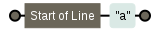
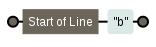
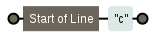
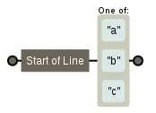

O metacaractere circunflexo marca o começo de uma linha, serve para procurar no começo da linha.

Só é especial no começo da expressão regular.

<table>
    <thead>
        <tr>
            <th>expressão regular</th>
            <th>casa com...</th>
            <th>diagrama</th>
        </tr>
    </thead>
    <tbody>
        <tr>
            <td><code>^a</code></td>
            <td>
                <code>a</code>brir 
                bolar 
                colar
            </td>
            <td></td>
        </tr>
        <tr>
            <td><code>^b</code></td>
            <td>
                abrir 
                <code>b</code>olar 
                colar
            </td>
            <td></td>
        </tr>
        <tr>
            <td><code>^c</code></td>
            <td>
                abrir 
                bolar 
                <code>c</code>olar
            </td>
            <td></td>
        </tr>
        <tr>
            <td><code>^[abc]</code></td>
            <td>
                <code>a</code>brir 
                <code>b</code>olar 
                <code>c</code>olar
            </td>
            <td></td>
        </tr>
    </tbody>
</table>

Circunflexo no começo de uma lista
---

Atenção!

O circunflexo no início de uma [lista](/regex/metacaractere-lista/) compõe a [lista negada](/regex/metacaractere-lista-negada/).

A expressão `^[0-9]` casa com um número que estiver no começo da linha (linhas que começam com um número).

Já a expressão `[^0-9]` casa com qualquer coisa que NÂO seja um número.

E a expressão `^[^0-9]` casa com qualquer coisa que não seja um número desde que esteja no início do texto (subject) procurado.

Repetindo... o circunflexo, como marcador de começo de linha, só é especial se estivar no começo da expressão regular.
