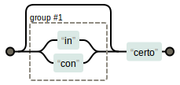

O metacaractere grupo agrupa opções, dentro do grupo podemos ter um ou mais caracteres, metacaracteres e outros grupo.

Grupos servem para agrupar.

Podem conter outros metacaracteres e inclusive outros grupos.

A expressão regular `boa-(tarde|noite)` casa com `boa-tarde` e `boa-noite`, mas não casa com  `boa-sorte` e `bom-dia`.

Outro exemplo seria a expressão regular `(super|hiper)mercado` que casa com `supermercado` e `hipermercado` mas não casa
com `minimercado` e `mercado`.

Junto com o [metacaractere opcional (?)](/regex/metacaractere-opcional/) temos o exemplo `(in|con)?certo` que casa com
`incerto`, `concerto` e `certo`.

