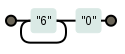

O metacaracter `+` (mais) tem funcionamento idêntico ao do `*` (asterisco), a única diferença é que o mais não é 
opcional, então a entidade anterior deve casar pelo menos uma vez, e pode ter várias.

* ter (pelo menos uma vez), 
* ou ter vários.

<table>
    <thead>
        <tr>
            <th>expressão regular</th>
            <th>casa com...</th>
            <th>diagrama</th>
        </tr>
    </thead>
    <tbody>
        <tr>
            <td><code>6+0</code></td>
            <td>60, 660, 6660, 6666666666660</td>
            <td></td>
        </tr>

    </tbody>
</table>

Muito útil quando queremos no mínimo uma repetição.