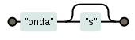

O quantificador opcional indica que pode ter ou não a ocorrência da entidade anterior, pois ele a repete 0 ou 1 vez.

O opcional é útil para procurar palavras no singular e plural.

Podemos tornar opcionais caracteres e metacaracteres.

<table>
    <thead>
        <tr>
            <th>expressão regular</th>
            <th>casa com...</th>
            <th>diagrama</th>
        </tr>
    </thead>
    <tbody>
        <tr>
            <td><code>ondas?</code></td>
            <td>onda e ondas</td>
            <td></td>
        </tr>
        <tr>
            <td><code>fala[r!]?</code></td>
            <td>fala, fala! e falar</td>
            <td></td>
        </tr>
        <tr>
            <td><code>&lt;/?[bip]&gt;</code></td>
            <td>&lt;b&gt;, &lt;/b&gt;, &lt;i&gt;, &lt;/i&gt;, &lt;p&gt; e &lt;/p&gt;</td>
            <td></td>
        </tr>
    </tbody>
</table>