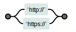
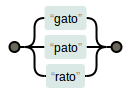

O metacaractere "ou" | serve para os casos em que temos mais de uma alternativa possível.

A expressão regular `boa-tarde|boa-noite` casa com a duas opções.

Um outro exemplo seria endereço de internet `http://|https://`.

Podemos ter tantas opções quanto seja preciso, veja exemplo seguinte.

O grupo multiplica o poder do "ou".