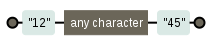

O ponto casa com qualquer coisa.

O ponto casa com o ponto.

O ponto é um curinga para casar um caractere

<table>
    <thead>
        <tr>
            <th>expressão regular</th>
            <th>casa com...</th>
            <th>diagrama</th>
        </tr>
    </thead>
    <tbody>
        <tr>
            <td><code>e.tendido</code></td>
            <td>estendido, extendido, eztendido</td>
            <td></td>
        </tr>
        <tr>
            <td><code><.></code></td>
            <td>&lt;b&gt;, &lt;i&gt;, &lt;p&gt;</td>
            <td></td>
        </tr>
        <tr>
            <td><code>12.45</code></td>
            <td>12:45, 12 45, 12.45</td>
            <td></td>
        </tr>
    </tbody>
</table>

