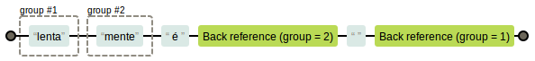
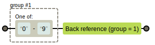

A utilização do [metacaractere grupo](/regex/metacaractere-grupo/) possibilita a captura de um trecho de texto casado 
pela expressão regular que fica armazenado em um cantinho especial e pode ser usado em outras partes da mesa expresão. 
O nome "retrorreferêcia" (backreference) é porque ele olha para trás em busca de um trecho já casado. O Aurélio Marinho
o chama da __retrovisor__.

A expressão `in(d)ol(or) é sem \1\2` casa inteiramente com o texto "indolor é sem dor".

A expressão `(lenta)(mente) é \2 \1` casa inteiramente com o texto "lentamente é mente lenta".

A expressão `([0-9])\1` casa com dois números repetidos "61 62 63 64 65 `66` 67 68 69 70".

