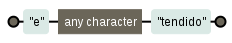
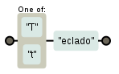
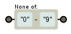
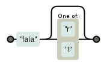
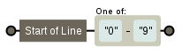
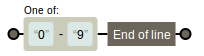
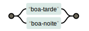
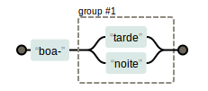
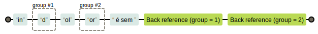

Neste artigo você verá uma síntese de cada metacaracter e logo abaixo um link para se aprofundar o assunto.

Metacaractere ponto .
---

O ponto casa com qualquer coisa.

O ponto é um curinga para casar um caractere

A expressão `e.tendido` casa com `estendido`, `extendido`, `eztendido` e etc...

Veja mais sobre o [metacaractere ponto](../metacaractere-ponto/)

Metacaractere lista [ ]
---

A lista casa com quem ela conhece e tem suas próprias regras.

A expressão `[tT]eclado` casa com `teclado` e `Teclado`.

Veja mais sobre o [metacaractere lista](../metacaractere-lista/)

Metacaractere lista negada [^]
---

Ela casará com qualquer coisa fora os componentes listados.

Exemplo, a expressão regular `[^0-9]` casa com qualquer coisa menos os números.

Veja mais sobre o [metacaractere lista negada](../metacaractere-lista-negada/)

Metacaractere opcional ?
---

O quantificador opcional indica que pode ter ou não a ocorrência da entidade anterior, pois ele a repete 0 ou 1 vez.

A expressão `fala[r!]?` casa com `fala`, `fala!` e `falar`.

Veja mais sobre o [metacaractere opcional](../metacaractere-opcional/)

Metacaractere *	asterisco
---

O asterisco repete em qualquer quantidade

A expressão `6*0` casa com `0`, `60`, `660`, `6660`, `6666666666660`.

Veja mais sobre o [metacaractere asterisco](../metacaractere-asterisco/)

Metacaractere +	mais
---

O mais tem funcionamento idêntico ao do asterisco, a única diferença é que o mais não é opcional, então a entidade 
anterior deve casar pelo menos uma vez, e pode ter várias.

A expressão `6+0` casa com `60`, `660`, `6660`, `6666666666660`.

Veja mais sobre o [metacaractere mais](../metacaractere-mais/)

Metacaractere {}	chaves
---

O quantificador chaves funciona como uma repetição mais controlada, onde `{n,m}` significa de `n` até `m` vezes.

A expressão `n{1,4}` casa "n", "nn", "nnn" e "nnnn" (exatamente isso; nem mais, nem menos).

Veja mais sobre o [metacaractere chaves](../metacaractere-chaves/)

Metacaractere ^	circunflexo
---

O metacaractere circunflexo marca o começo de uma linha, serve para procurar no começo da linha.

A expressão `^[0-9]` casa com um número que estiver no começo da linha (linhas que começam com um número).

Veja mais sobre o [metacaractere circunflexo ^](../metacaractere-circunflexo/)

Metacaractere $	cifrão
---

O metacaractere cifrão marca o fim de uma linha e só é válido no final de uma ER.

Veja mais sobre o [metacaractere cifrão $](../metacaractere-cifrao/)

Metacaractere \b borda
---

O metacaractere borda marca a borda de um "trecho" (letras, números e sublinhado).

A borda é útil para marcar palavras exatas e não parciais.

A expressão `\bdia\b` casa com a palavra inteira "dia".

Já com a parcial "dia" da palavra "diafragma" ela não casa.

Veja mais sobre o [metacaractere borda \b](../metacaractere-borda/)

Metacaractere \	escape
---

O metacaractere escape \ permite o uso do valor literal determinado símbolo que coincide com um metacaratere existente.

Em outras palavras, imagine que você precise casar o termo "meio*maluco", você precisa daquele asterisco no meio do 
termo.

A expressão `meio\*maluco` casa com o termo exato `meio\*maluco`.

Veja mais sobre o [metacaractere escape \](../metacaractere-escape/)

Metacaractere |	ou
---

O metacaractere "ou" | serve para os casos em que temos mais de uma alternativa possível.

A expressão regular `boa-tarde|boa-noite` casa com a duas opções.

Veja mais sobre o [metacaractere ou |](../metacaractere-ou/)

Metacaractere () grupo
---

Grupos servem para agrupar.

Podem conter outros metacaracteres e inclusive outros grupos.

A expressão regular `boa-(tarde|noite)` casa com `boa-tarde` e `boa-noite`, mas não casa com  `boa-sorte` e `bom-dia`.

Veja mais sobre o [metacaractere grupo ()](../metacaractere-grupo/)

Metacaractere \1 ... \9	retrorreferência
---

A utilização do [metacaractere grupo](/regex/metacaractere-grupo/) possibilita a captura de um trecho de texto casado 
pela expressão regular que fica armazenado em um cantinho especial e pode ser usado em outras partes da mesa expresão. 

A expressão `in(d)ol(or) é sem \1\2` casa inteiramente com o texto "indolor é sem dor".

