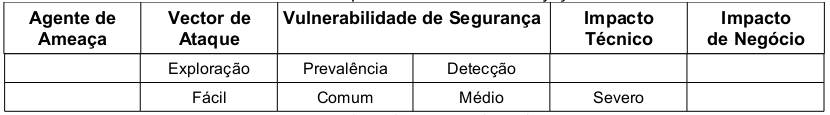

A Injeção caracteriza-se quando o atacante, incluindo utilizadores internos e administradores, podem enviar dados não
confiáveis ao sistema, ou seja, sem tratamento adequado. Esses dados (na verdade trata-se de strings que formam uma
consulta, queries) chegam até o sistema e atingem um interpretador de comandos. A injeção pode ocorrer como consultas
SQL, LDAP ou Xpath. "...este método é particularmente perigoso, pois consiste na inserção de código SQL não previsto e,
de modo arbitrário, compromete toda a funcionalidade do sistema e também da base de dados." (SICA; REAL, 2007, p 65)

Segundo o projeto OWASP Top 10 (2010) a classificação do risco é enquadrado da seguinte forma: o vetor de ataque é
considerado fácil pois pode ser constituído por qualquer fonte de dados. A detecção é considerada média porque é fácil
encontrá-la quando se faz uma verificação do código fonte da aplicação, porém é mais difícil através de testes.
Scanner e Fuzzers poderão ajudar os atacantes a encontrá-las. O impacto para o negócio é severo pois pode, por exemplo,
prejudicar toda a base de dados e pode também dar acesso total do sistema ao atacante. A tabela 02 sintetiza a
classificação do risco.



Todo formulário web pode servir como porta de entrada(uma vulnerabilidade) para o ataque de Injeção de SQL. É mais
comum este ataque acontecer na tela de login, pois este é o primeiro formulário do sistema e normalmente é mais exposto
do que os demais formulários. Mas isso não significa que os formulário internos (os posteriores à tela de login) do
sistema não precisem de prevenção. É importante lembrar que o atacante pode ser externo (provavelmente atacando a tela
de login) e interno (usuário do sistema mal intencionado). O atacante tentará, através de várias tentativas, descobrir
a estrutura do banco de dados, por isso é importante que os nomes de campos dos formulários não lembrem os nomes dos
campos do banco de dados. conforme relata Pessoa (2007, p. 108)

> é necessário que o atacante realize tentativas de acesso para
> conhecer a estrutura do banco de dados. Essa tarefa se torna
> mais fácil quando os nomes das variáveis usadas em
> formulário HTML são usados na estrutura do banco de dados,
> afinal o código HTML é legível aos usuários da web.

Importante salientar que a utilização de nomes de variáveis diferentes não impedirá o ataque de injeção de SQL.
Pessoa (2007, p. 108)

Como exemplo de aplicação vamos considerar o formulário de login apresentado abaixo.


```html
<!DOCTYPE html PUBLIC "-//W3C//DTD XHTML 1.0 Strict//EN"
"http://www.w3.org/TR/xhtml1/DTD/xhtml1-strict.dtd">
<html xmlns="http://www.w3.org/1999/xhtml" lang="pt-br">
  <head>
    <title>Página de login</title>
    <meta http-equiv="Content-Type" content="text/html; charset=UTF-8"/>
  </head>
  <body>
      <p>Está é a tela de login!!!</p>
      <form action="receber_formulario.php" method="post">
          <p>Login:<input type="text" name="login" value="" /></p>
          <p>Senha:<input type="text" name="senha" value="" /></p>
          <p><input type="submit" value="Efetuar login" /></p>
      </form>
  </body>
</html>
```

O código que interage com o formulário deve receber os dados vindo do formulário, conectar-se com o banco
de dados, montar a declaração SQL, enviá-la para o banco de dados (o interpretador) e checar se houve êxito na execução
da declaração.

```php
<?php
$login  = $_POST['login'];
$senha  = $_POST['senha'];

$mysqli = new mysqli("localhost", "desenvolvedor", "12345678", "teste");

$sql    = "SELECT * FROM usuarios WHERE login = '$login' AND senha = '$senha'";
$result = $mysqli->query($sql);

if( $result->num_rows )
    echo "Você foi logado no sistema!!!";
else
    echo "Você não foi logado no sistema!!!";

var_dump($sql);
```

As linhas 2 e 3 recebem os dados vindos do formulário via método `post` e armazenam em suas respectivas variáveis. A
linha 5 conecta-se com o banco de dados. A linha 7 cria dinamicamente a declaração SQL. A linha 8 envia e executa a
declaração SQL para o banco de dados. A linha 10 testa o resultado e em caso afirmativo permite acesso e registra
credenciais do usuário no sistema. A linha 15 utiliza-se da função PHP `var_dump()` para debugar o código, ela mostra o
conteúdo e tipo da variável. Neste exemplo, é preciso ver o que aconteceu com a variável `$sql`.

O código se torna vulnerável, principalmente, pelo fato de construir a declaração SQL dinamicamente (vide linha 7). Os dados
que chegam do formulário não são tratados adequadamente e acabam por compor uma declaração SQL maliciosa.

Segundo Wichers e Manico (2011) a vulnerabilidade de Injeção pode ser prevenida de três formas distintas:

1. utilizando-se de consultas parametrizadas,
2. utilizando-se de procedimentos armazenados (stored procedures) e
3. codificando (leia-se escapando) caracteres de entrada

A primeira forma (consultas parametrizadas) utilizam-se de recursos internos do SGBD para preparar a declaração SQL.
Essa abordagem não cria a declaração SQL dinamicamente, garantindo assim, que a declaração não seja alterada indevidamente.

No PHP é possível contar com a extensão PDO para utilizar-se de consultas parametrizadas. Essa extensão define uma
interface consistente para acesso a banco de dados em PHP. Ela facilita a manutenção do código fonte e auxilia a troca
de banco de dados utilizado na codificação. (GILMORE, 2008 p.631)

O código abaixo faz uso da extensão PDO, entre as linhas 3 e 11 ocorre a conexão com o banco de dados, na linha 9 é
instanciada a classe PDO. As linhas 13 e 14 recebem os dados do formulário. A linha 16 utiliza o método prepare() do
objeto instanciado para preparar o comando SQL, repare que não é passado os parâmetros diretamente na declaração SQL,
em seu lugar estão apenas as referências ":login" e ":senha". A função principal é a bindParam() que "liga-se um
parâmetro para o nome da variável especificada" (Manual Oficial do PHP, 2011) é ela quem faz todo o trabalho de
sanitização. A linha 20 executa o comando e, entre as linhas 22 e 25, é checado o resultado da consulta.

```php
<?php
$dsn        = 'mysql:dbname=teste;host=localhost';
$user       = 'desenvolvedor';
$password   = '12345678';

try {
    $dbh = new PDO($dsn, $user, $password);
} catch (PDOException $e) {
    $log = $e->getMessage();
    # gravar o log
}

$login = $_POST['login'];
$senha = $_POST['senha'];

$sth = $dbh->prepare("SELECT * FROM usuarios ".
                     "WHERE login = :login AND senha = :senha");
$sth->bindParam(':login', $login);
$sth->bindParam(':senha', $senha);
$sth->execute();

if( $sth->rowCount() )
	echo "reusultado: true";
else
	echo "reusultado: false";
```

A segunda forma, stored procedures (SP), são procedimentos previamente armazenados no SGBD. Seu funcionamento é similar
as funções em uma linguagem de programação. SP podem receber ou não parâmetros e podem retornar ou não algum valor. A
inconveniência dessa abordagem é que ela torna a aplicação pouco portável, pois diferentes SGBD utilizam diferentes
implementações da SP, ou seja, uma SP funcionando em MYSQL, por exemplo, poderá não funcionar em outro SGBD e vice-versa.

As operações da SP, por serem previamente elaboradas, não executarão aquilo que elas não foram desenhadas para executar
garantindo assim a integridade da declaração SQL.

No código abaixo, entre as linhas 2 e 6 o código faz a conexão com o banco de dados através do driver mysqli (conjunto
de código com o objetivo de realizar e gerenciar a conexão entre o código fonte e o SGBD). As linhas 8 e 9 recebem os
dados vindos do formulário. Entre as linhas 11 e 13 é montado um array na variável `$query` onde o índice 0 (zero) contém
o comando SQL que faz "chamada" para a SP e o índice 1 recupera o valor retornado pela SP. A linha 15 executa o comando SQL
do índice o(zero). A linha 16 executa o comando SQL de índice 1 e guarda o seu resultado na variável `$res`. A linha 17
apenas transforma o resultado da consulta em um objeto. Entre as linhas 20 e 24 checamos o resultado da consulta.

```php
<?php
$mysqli = new mysqli("localhost", "desenvolvedor", "12345678", "teste");
if (mysqli_connect_errno()) {
    $log = "Falha na conexão:". mysqli_connect_error();
    # gravar log
}

$login   = $_POST['login'];
$senha   = $_POST['senha'];

$query   = array();
$query[] = "CALL testarLogin(@valor, '".$login."', '".$senha."')";
$query[] = "SELECT @valor";

$mysqli->query($query[0]);
$res     = $mysqli->query($query[1]);
$valor   = $res->fetch_object();
$nome    = "@valor";

if( $valor->$nome )
    echo "reusltado: true";
else
    echo "reusltado: false";

$mysqli->close();
?>
```

A stored procedure utilizada é ilustrada pelo código abaixo.

```sql
CREATE PROCEDURE testarLogin(
    OUT quant INT,
    IN param1 VARCHAR(200),
    IN param2 VARCHAR(20)
)
BEGIN
    SELECT COUNT(*) INTO quant FROM usuarios WHERE login = param1 AND senha = param2;
END #
```

A terceira e última forma, codificação de saída de caractere, também conhecida como "escapar caractere", é utilizar
determinada função com o objetivo de codificar a saída de caracteres indesejados, no caso `'`(aspa simples), `''`
(aspas duplas), `\` (barras), `\n` (quebra de linhas) e `\r` (recuo de carro). Existem várias funções com esse objetivo
e também podem ser aplicadas diferentes abordagens para codificação de saída de caracteres. Wichers (2011) Sugere que a
função nativa do SGBD Mysql `mysql_real_escape_string()` seja utilizada para codificação de caracteres. O uso dessa
função é implementada no código abaixo.

```php
<?php
$link = mysql_connect('localhost', 'desenvolvedor', '12345678');
mysql_select_db("teste");
if (!$link) {
    die('Falha na conexão!');
}

$login = $_POST['login'];
$senha = $_POST['senha'];

$login = mysql_real_escape_string($login, $link);
$senha = mysql_real_escape_string($senha, $link);

$sql = "SELECT * FROM usuarios WHERE login = '$login' AND senha = '$senha'";

$result = mysql_query($sql);

if( mysql_num_rows($result) == 1 ){
	echo "reusltado: true";
}else{
	echo "reusltado: false";
}
```

Observando o código nota-se que entre a linha 2 e 6 é feita a conexão com o banco de dados feito através do driver mysql.
As linhas 8 e 9 recebem os dados do formulário. As linhas 11 e 12 fazem o trabalho de codificação de saída dos caracteres
utilizando-se da função `mysql_real_escape_string()`. A linha 14 monta o declaração SQL de forma dinâmica, porém de forma
segura pois foi feito o tratamento de dados adequado. A linha 16 executa a declaração SQL e entre as linhas 18 e 22 é
feita a checagem do resultado.