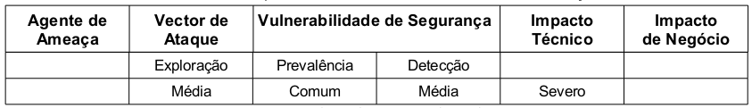

Esta vulnerabilidade está relacionada com a autenticação e o gerenciamento de sessão da aplicação web. Esta 
vulnerabilidade se caracteriza quando a aplicação apresenta falhas em áreas como a saída de sessão (logout), gestão de
palavras chave, expiração de sessões, sistemas do tipo "lembre- me" (remember me), questões secretas e atualizações de
conta. Dentro do universo de autenticação e gerenciamento de sessões essas funções são consideradas menos importantes e,
por essa razão, as mais atacadas. Não obstante, falhas no mecanismo principal não são incomuns.

A detecção é de nível médio, pois encontrar essas falhas pode ser difícil tarefa, uma vez que cada implementação tem
suas próprias características. As ferramentas automatizadas dificilmente obtém sucesso com esta vulnerabilidade, da
mesma forma as ferramentas de análise estática não são eficazes. A análise manual, revisão de código e teste são mais
indicadas, especialmente se combinadas. O nível de exploração é mediano, o atacante utiliza-se de falhas nas funções de
autenticação ou de gestão de sessões. O atacante pode ser um agente externo anônimo. Utilizadores internos que tentam
furtar as contas (login) de outros usuários ou que procuram disfarçar suas ações também devem ser considerados. Sendo o 
ataque bem sucedido o atacante poderá fazer tudo como se fosse a vítima, conta de acesso com maiores privilégios são, 
frequentemente, as mais visadas. A tabela abaixo sintetiza a classificação do risco.

Exemplo de aplicação vulnerável
---

Este tipo de vulnerabilidade não permite que seja elencado um único código fonte como exemplo, pois o mesmo é particular
a cada aplicação web. Da mesma forma sua prevenção não se faz em apenas um código ou em uma única forma.
OWASP Top 10 (2010)

Quando os processos de expiração da sessão não estão implementados de forma adequada o sistemas encontra-se vulnerável,
por exemplo, o usuário utiliza um computador público para acessar a um sistema web, ao termino de sua utilização ele em
vez de selecionar a opção de "logout" para sair da sessão, ele simplesmente fecha a janela do navegador web e vai-se 
embora. Um atacante pode utilizar o mesmo navegador web uma hora mais tarde e mesmo assim a sessão original continua 
ativa e devidamente autenticada.

Outro exemplo é quando a aplicação web suporta a reescrita de URL e coloca os identificadores de sessão diretamente na 
URL. Um usuário autenticado poderia querer que seus amigos soubessem da venda. Ele encaminha por e-mail o a URL sem saber
que o identificador da sessão acompanha a URL. Quando um de seus amigos acessar a URL ele não só usará o identificar de 
sessão como também os dados pertinentes à sua conta de acesso, como por exemplo, número de cartão de crédito associado a
sessão.

Um atacante mais experiente, notando que o sistema lhe pede para  responder a uma pergunta como por exemplo, "Qual é a 
sua cor favorita?", poderá recuperar a senha de acesso utilizando-se um aplicativo para aplicar um ataque do tipo 
"task force" até que seja descoberta a cor correta que satisfaça a pergunta. O aplicativo de "task force" é configurado
para realizar requisições subsequentes e em cada uma delas uma cor será testada, a cor correta é descoberta pela 
resposta de cabeçalho HTTP da aplicação que quando a cor está errada envia uma resposta negativa e quando a cor está 
correta envia uma resposta afirmativa.

Prevenção
---

O objetivo da prevenção é verificar se o aplicativo autentica corretamente os usuários e protege as identidades das
credenciais.

A recomendação primária do OWASP Top 10 (2010) é:

* Tornar disponível para os programadores um conjunto único de controles de autenticação forte e de gestão de sessões. 
  Este controles devem ser capazes de atender a todos os requisitos para autenticação e gestão de sessões definidos no
  documento "Application Security Verification Standar(ASVS)" em particular as seções V2(Autenticação) e V3 (Gestão de
  Sessões) e também, ter uma interface simples para os programadores. (considere o autenticador da ESAPI).
* Grandes esforços devem ser igualmente realizados para evitar a ocorrência da falhas XSS que podem ser utilizadas
  para furto de identificadores de sessão (Veja A2).

Enquanto que no OWASP Top 10 (2007) é preciso considerar ainda as seguintes recomendações

1. Use somente mecanismos padrão para gerenciamento de sessão. Não escreva ou use gerenciadores secundários de sessão 
   em qualquer situação.
2. Não aceite novos identificadores de sessão, pré configurados ou inválidos na URL ou em requisições. Isto é conhecido
   como ataque de sessão fixada (session fixation attack ).
3. Limite ou limpe seu código de cookies personalizados com propósito de autenticação de gerenciamento de sessão, como
   funções "lembrar meu usuário" ou funções domésticas de autenticação centralizadas como o Single Sign-On(SSO). Isto 
   não se aplica as soluções de autenticação federadas robustas ou SSO reconhecidas.
4. Use um mecanismo único de autenticação com dimensão e números de fatores apropriados. Certifique-se que este mecanismo
   não estará facilmente sujeito à ataques ou fraudes. Não faça esse mecanismo complicado demais, pois ele pode se 
   tornar alvo de seu próprio ataque.
5. Não permita que o processo de login comece de uma página não encriptada. Sempre inicie o processo de login de uma
   segunda página encriptada ou de um novo código de sessão, para prevenir o roubo de credenciais ou da sessão, phishing  
   e ataques de fixação de sessão.
6. Considere gerar uma nova sessão após uma autenticação que obteve sucesso ou mudança do nível de privilégio.
7. Assegure-se que todas as páginas tenham um link de logout. O logout deve destruir todas as sessões e cookies de 
   sessão. Considere os fatores humanos: não pergunte por confirmação,pois usuários acabarão fechando a aba ou janela ao
   invés de sair com sucesso.
8. Use períodos de expiração de prazo que fazem automaticamente logout em sessões inativas, bem como o conteúdo das 
   informações que estão sendo protegidas.
9. Use somente funções de proteção secundárias eficientes (perguntas e respostas, reset de senha), pois estas 
   credenciais são como senhas, nomes de usuários e tokens. Aplique one-way hasf nas respostas para prevenir ataques 
   nos quais a informação possa ser descoberta.
10. Não exponha nenhum identificador de sessão ou qualquer parte válida das credenciais em URLs e logs (não regrave ou
    armazene informações de senhas de usuários em logs).
11. Verifique a senha antiga do usuário quando ele desejar mudar a senha.
12. Não confie em credenciais falsificáveis como forma de autenticação, como endereços de IP ou máscaras de rede, 
    endereço de DNS ou verificação reversa de DNS, cabeçalhos da origem ou similares.
13. Atente para quando enviar segredos para endereços de e-mail como um mecanismo de reset de passsword. Use números 
    randômicos limited-time-only para resetar acesso e envie um e-mail de retorno assim que a senha for reconfigurada. 
    Cuide para quando permitir que usários registrados mudem seus endereços de e-mail – envie uma mensagem para o e-mail
    anterior antes de efetuar a mudança.

