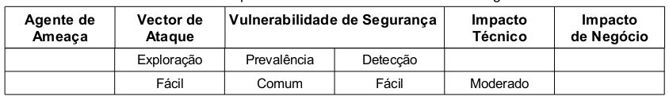

A Referências Inseguras Diretas a Objeto ocorre quando o desenvolvedor expõe uma referência a objetos internos da
aplicação web e o atacante consegue alterar esse parâmetro obtendo, dessa forma, acesso a informações confidenciais.
Os objetos internos podem ser, por exemplo, um arquivo, um diretório ou um registro do banco de dados exposto através de
uma URL ou formulário. O atacante é um usuário autorizado no sistema que altera o valor de um parâmetro, que se refere
diretamente a um objeto no sistema, para um outro objeto na qual não teria autorização. O impacto é considerado moderado
pois a exploração desta vulnerabilidade pode comprometer todos os dados que são referenciados através de parâmetros, a
tabela abaixo sintetiza a classificação do risco.



Para descobrir se uma aplicação é vulnerável a Referências Inseguras Diretas a Objetos é preciso verificar se todas as
referências a objetos possuem defesas próprias.

Essas defesas consistem em...

1. verificar se o usuário está autorizado a aceder o recurso que foi solicita e
2. se a referência é uma referência indireta

O mapeamento para a referência direta deve ser limitada aos valores autorizados para o usuário atual. Para que a
revisão do código seja eficiente é preciso considerar as duas abordagens de defesas. Teste manuais também são igualmente
eficientes. Os teste automáticos não são indicados, pois não procuram este tipo de falha uma vez que não reconhecem o
que necessita de proteção.


Exemplo de aplicação vulnerável
---

O atacante acessa a página de cadastro de determinado cliente com chave de identificação de número `1015`, por exemplo.
Ele percebe que o parâmetro que recupera o cliente da base de dados está sendo enviado via método `post` e chama-se
`idCliente`. A chave de registro da tabela `clientes` é do tipo numérica e sequencial, logo, o atacante percebe que se
mudar o parâmetro de `1015` para `1014` o sistema retorna o registro do cliente de chave número `1014`. O atacante continua
testando outros valores, os que coincidirem com os da tabela `clientes` a aplicação mostrará os registro, indevidamente.
O código abaixo ilustra a aplicação vulnerável. Ele é apenas um trecho de código, as demais partes foram suprimidas para
simplificação do entendimento. A linha 02 recebe os dados, no caso a chave de cada registro de cliente. As linhas 4, 5 e
6 montam executam a instrução SQL. Repare que mesmo a aplicação estando protegida contra Injeção (vide A1- Injeção)
ele não está, necessariamente, protegida contra Referências Inseguras Diretas a Objetos.

```php
<?php
$idCliente = $_POST['idCliente'];

$sth = $dbh->prepare("SELECT * FROM clientes ".
                     "WHERE idCliente = :idCliente");
$sth->bindParam(':idCliente', $idCliente);
$sth->execute();
```


Outro exemplo de aplicação vulnerável é ilustrado pelo formulário do código abaixo. O formulário envia através do método
`get` o valor do controle HTML do tipo "select" denominado idioma. O script PHP responsável por trocar o idioma faz acesso
direto ao objeto tornando, dessa forma, o código vulnerável.

```html
<!DOCTYPE html PUBLIC "-//W3C//DTD XHTML 1.0 Strict//EN"
"http://www.w3.org/TR/xhtml1/DTD/xhtml1-strict.dtd">
<html xmlns="http://www.w3.org/1999/xhtml" lang="pt-br">
  <head>
    <title>Escolha um idioma</title>
    <meta http-equiv="Content-Type" content="text/html; charset=UTF-8"/>
  </head>
  <body>
      <form action="alterarIdioma.php" method="get">
          <p>Formulário que altera o idioma.</p>
          <p>
          <select name="idioma">
              <option value="en">Inglês</option>
              <option value="pt">Português</option>
          </select>
          </p>
          <p><input type="submit" value="Efetuar login" /></p>
      </form>
  </body>
</html>
```


O atacante poderia alterar o parâmetro para, por exemplo, `/etc/passwd` e assim obter acesso ao arquivo de usuários do
sistema operacional Linux, conforme ilustra o código abaixo.

```php
<?php

require $_REQUEST['idioma'];

# demais código

?>

```


Prevenção
---

Segundo o OWASP Top 10 (2010) há duas formas básicas de evitar esta vulnerabilidade:

1. usar referências indiretas a objetos e
2. verificar o acesso ao objeto.

Já o OWASP Top 10 (2007) nos diz que a proteção mais eficaz a esta vulnerabilidade seria evitar a exposição direta de
referências a objetos a usuários usando um índice, mapa de referência indireta ou outro método indireto que seja
fácil validar. Ainda como prevenção o OWASP Top 10 (2007) reitera que, é necessário considerar as recomendações como
observamos abaixo:

* Sempre que possível, evitar a exposição de referências de objetos privados a usuários, como chaves primárias e nomes de arquivos.
* Através da abordagem "aceite o reconhecido como bom"(whit list) validar cada referência privada a objetos.
* Verificar a autorização de todos os objetos referenciados. O método mais indicado é usar um valor de índice ou um mapa
de referência para prevenir ataques de manipulação de parâmetros
* Se expor referências diretas aos registros de banco de dados certifique-se que as declarações SQL e outros métodos de
acesso à base de dados permitam que somente sejam mostrados registros autorizados.

O código 4.1 corrigido deve apresentar-se como o código abaixo. A principal alteração acontece na linha 5 onde é construída
a instrução SQL, na clausula `WHERE` além de filtrar por cliente a instrução filtra por usuário, ou seja, apenas o
usuário previsto para aquele registro poderá realmente acessá-lo.

```php
<?php
$idCliente = $_POST['idCliente'];
$idUsuario = $usuario->getId();

$sth = $dbh->prepare("SELECT * FROM clientes ".
                     "WHERE idCliente = :idCliente AND idUsuario = :idUsuario");
$sth->bindParam(':idCliente', $idCliente);
$sth->bindParam(':idUsuario', $idUsuario);
$sth->execute();
?>
```

O código abaixo é a versão corrigida. A linha 2 cria um array com dois índices e armazena em `$array_idiomas`, trata-se do
mapeamento ao objeto. A linha 4 recebe o dado via método post ou get e armazena em `$idioma_suspeito`. A linha 5 apenas
inicializa a variável `$idioma_seguro`. A Linha 7 utiliza-se expressão regular para checar, através do método "white list"
o parâmetro recebido. A linha 8 checa o parâmetro recebido com o "mapa" construído na linha 2 e em caso positivo
concatena o valor de `$idioma_suspeito` com a string `".php"`(linha 9). A linha 11 executa o código normalmente.

```php
<?php
$array_idiomas   = array("en", "pt");

$idioma_suspeito = $_REQUEST['idioma'];
$idioma_seguro   = "";

if( preg_match("/^[0-9]{1}$/", $idioma_suspeito) ){
    if(  in_array($idioma_suspeito, $array_idiomas)  ){
        $idioma_seguro = $idioma_suspeito.".php";

        require $idioma;
        # demais código

    }else{
        # registrar possível tentativa de ataque
    }
}else{
    # registrar possível tentativa de ataque
}
?>
```