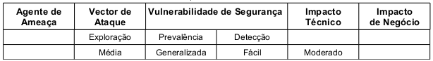

O Cross Request Forgey(CSRF) ocorre quando um atacante consegue forjar um pedido HTTP tornando indistinguível do pedido
 original. Normalmente combina a utilização de cookies de sessão e engenharia social. Aproveita, principalmente, de
aplicações que confiam excessivamente em credenciais de acesso geradas automaticamente. Esta vulnerabilidade normalmente
está associada ao uso de cookies de sessão, mas também podem ocorrer com a utilização de, por exemplo, endereço IP de
origem, certificados SSL (o SSL somente provê a confidencialidade e a integridade dos dados trafegados), credenciais de
autenticação básicas e até mesmo credenciais de um domínio Windows.

A prevalência é considerada generalizada pois o CSRF explora aplicações web que permitem aos atacantes prever todos os
detalhes de determinada ação. A detecção é considerada fácil por ser razoavelmente fácil detectar através de teste de
penetração ou através de análise de código. A tabela abaixo sintetiza a classificação do risco.




Esta vulnerabilidade também é conhecida por outros nomes como Session Riding, Ataques On-Click, Cross Site Reference
Forgey, Hostile Linking e Automation Attack. O acrônimo XSRF também é comumente utilizado. Tanto a OWASP quanto o MITRE
padronizaram o uso do termo Cross Site Request Forgey(CSRF).


Exemplo de aplicação vulnerável
---

Uma transferência bancaria é efetuada pelo scritp php denominado `transferirFundos.php`. Esse script está armazenado
no seguinte local:  `http://wwww.aplivacaovulneravel.com.br/app/` e aceita como entrada duas variáveis (`montante` e
`contaDestino`) que são enviadas pelo formulário web através do método get. O objetivo do script é transferir, da conta
corrente da vítima que está logada no sistema) o valor da variável `montante` para a conta registrada na variável
`contaDestino`. A código HTML abaixo ilustra o formulário original que envia os dados para o script encarregado de aplicar a
ação. Note que o formulário utiliza-se do método get o que facilita a exploração do CSRF e, note também a ausência de
um identificador único e imprevisível.

```html
<form action="transferirFundos.php" method="GET" name="frm">
    <label for="montante">Digite o valor que deseja transferir:</label>
    <input type="text" name="montante" id="montante"/>

    <label for="contaDestino">Digite o o número da conta para transferência:</label>
    <input type="text" name="contaDestino" id="contaDestino"/>

    <input type="submit" value="Efetuar operação" />
</form>
```


O código seguinte é responsável por receber os dados vindo do formulário e por efetuar a operação de transação entre as
contas. A vulnerabilidade encontra-se na linha 2 que confia apenas no cookie de identificação, ou seja, estando o usuário
logado a requisição poderá vir de qualquer parte e ser executada como uma requisição autêntica. A linha 2 recupera,
através do array `$_COOKIE` o cookie denominado `cliente_autenticado`. É utilizado a função `isset()` que checa se uma
variável foi inicializada retornando `true` em caso positivo e `false` em caso negativo. Ainda na linha 2, se o retorno
da função `isset()` for `true` o código que efetua a transação é executado. As linhas 3 e 4 são hipotéticas e por esta
razão estão comentadas (não surtem efeito algum), elas apenas ilustram como seria a operação de transação entre contas.

```php
<?php
if(  isset($_COOKIE['cliente_autenticado'])  ){
    echo "";
    # debitar $montante da conta corrente do usuário autenticado
    # creditar $montante na conta corrente de número $contaDestino
}
?>
```

O atacante, conhecendo os detalhes da aplicação, poderia modificar e enviar a url no corpo de um e-mail para uma vítima.
O código abaixo demonstra como a url pode ser alterada para executar a operação indevida.

    http://www.aplicacaovulneravel.com.br/app/trasnferirFundos.php?montante=1500&contaDestino=4673243243

O atacante insere o conteúdo malicioso em uma tag img conhecida como imagem de byte zero, veja código 5.4. Sendo a tag
de imagem incluída no e-mail, a vítima verá apenas uma pequena caixa que indica que o navegador não pôde processar a
imagem. No entanto, o navegador continua a enviar a solicitação para seu destino (www.aplicacaovulneravel.com.br). Dessa
forma o código é camuflado e não há qualquer indicação visual de que a transferência tenha ocorrido.

```html

```


Prevenção
---

A primeira forma de se prevenir contra XRSF é através de Tokens de validação, trata-se da inclusão de um token que não
seja transmitido via URL(método get) de modo que este não seja "adivinhado" pelo atacante nem registrado pelo navegador.
Ele pode ser inserido em um campo hidden, como demonstra o código abaixo. A linha 2 utiliza-se da função `getCSFRToken()`
para gerar o token que é armazenado na variável `$token`. A linha 3 atribui o valor de `$token` em uma session denominada
`csrfToken`. Essa session será utilizada pelo script seguinte. Entre a linha 5 e linha 16 é renderizado o formulário.
Um campo do tipo hidden (invisível apenas no layout da página HTML) armazenará o valor do token que por sua vez será
submetido com os demais dados do formulário.

```php
<?php
$token = $ESAPI->httpUtilities()->getCSRFToken();
$_SESSION['csrfToken'] = $token;
?>
<form action="transferirFundos.php" method="POST" name="frm">

    <label for="montante">Digite o valor que deseja transferir:</label>
    <input type="text" name="montante" id="montante"/>

    <label for="contaDestino">Digite o o número da conta para transferência:</label>
    <input type="text" name="contaDestino" id="contaDestino"/>

    <input type="hidden" name="csrfToken" value="<?php echo $token?>" />

    <input type="submit" value="Efetuar operação" />
</form>
```

Caso a submissão dos dados tenha que ser feita via método get é possível utilizar-se, então, de função
`ESAPI.httpUtilities().addCSRFToken()` da seguinte forma:

```php
<?php
$url = $ESAPI->httpUtilities()->addCSRFToken("http://www.site.br/action?param1=1");
```


Do lado do servidor, o script `transferirFundos.php`, também deve ser corrigido. A linha 2 confere se o token enviado
pelo formulário é o mesmo que o gerado anteriormente. Em caso positivo a execução pode seguir normalmente.
Em caso negativo é recomendado que grave-se um log, o token deve ser reinicializado e a solicitação deve ser abortada.

```php
<?php
if (  $_SESSION["csrfToken "] == $_POST["csrfToken"]  ){
    if(  isset($_COOKIE['cliente_autenticado'])  ){
        # debitar $montante da conta corrente do usuário autenticado
        # creditar $montante na conta corrente de número $contaDestino
    }
} else {
    # evento deve ser registrado como ataque CSRF potencial em andamento
    # o token deve ser reinicializado
    # solicitação deve ser abortada
}
?>
```