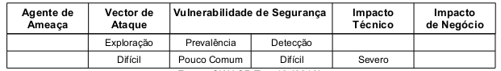

Quando dados sensíveis não são cifrados. Quando a criptografia é usada de forma incorreta, seja pela má configuração ou
pela escolha de algoritmo fraco. Quando o armazenamento das chaves é feito de forma imprudente. Quando, para proteger 
senhas, é utilizado um hash sem o salt. Todos esses fatores ou uma combinação deles tornam a aplicação vulnerável à
Armazenamento Criptográfico Inseguro. Importante notar que esta vulnerabilidade relaciona-se mais com questões de 
planejamento, infraestrutura e configurações de servidores do que com a linguagem de programação em si.

A exploração desta vulnerabilidade é considerada difícil não pelo fato de que a quebra da criptografia seja custosa e
complicada (quando humanamente possível) mas sim pelo fato de que atacantes externos terem acesso limitado, normalmente
eles tentam outras alternativas primeiro. É preciso observar também que dificilmente a criptografia é atacada, os 
atacantes quebram outros elementos tais como encontrar as chaves geradoras, obter cópias em claro de dados e acessar dados
através de canais que decifram automaticamente. A tabela abaixo sintetiza a classificação do risco.





Exemplo de aplicação vulnerável
---

Uma aplicação cifra dados dos cartões de créditos numa base de dados para prevenir que os mesmos sejam expostos ao 
utilizadores finais. No entanto, a base de dados está configurada para automaticamente decifrar consultas nas colunas de
cartões de crédito, permitindo que uma falha de injeção por SQL possa listar todos os cartões de crédito em claro. O 
sistema deveria ter sido configurado para permitir que apenas aplicações de back-end pudessem decifrar esses dados e não
as aplicações web de front-end.


Prevenção
---

Todos os perigos do uso inseguro da criptografia estão além do âmbito do escopo deste trabalho e, portanto, a prevenção
se fará parcialmente, através do uso correto das funções de encriptação do PHP e com as recomendações mínimas do 
OWASP Top 10 (2010):

* Não crie algorítimos de criptografia. Use somente algoritmos aprovados publicamente como, AES, Criptografia de chaves
publicas RSA, SHA-256 ou superior para hash.

* Não use algoritmos fracos como MD5/SHA-1. Utilize algoritmos mais seguros como SHA-256 ou superiores.

* Crie chaves offline e armazene chaves privadas com extremo cuidado. Nunca transmita chaves privadas em canais inseguros.

* Assegure que credenciais de infraestrutura, como por exemplo credenciais de banco de dados, estão corretamente seguras
(por meio de rígidos sistemas de arquivos e controles), criptografadas de forma adequada e não podem ser descriptografadas
 or usuários locais ou remotos.

* Dados armazenados criptografados no disco não devem ser fáceis de descriptografar, por exemplo, criptografia de banco 
de dados é inútil se a conexão de banco de dados permite acessos não criptografados.

A função hash do código abaixo utiliza dois parâmetros. O primeiro escolhe o algoritmo utilizado para gerar o hash e o 
segundo é o valor utilizado para gerar o hash.

```php
<?php

echo hash('sha256', 'senha');

?> 
```

Se executarmos o código seguinte ele gerará um array contendo todos os algorítimos que podem ser utilizados como 
parâmetro na função `hash()`;

```php
<?php

print_r( hash_algos() );

?>
```

A seguinte seguinte ilustra todos os algorítimos que podem ser usados juntos com a função `hash()`. A funcção `hash_algos()`
não lsita todos os algoritmos possíveis, mas sim todos os a os algoritmos que foram compilados e instalados.

- Md2
- md4
- md5
- sha1
- sha224
- sha256
- sha384
- sha512
- ripemd128
- ripemd160
- ripemd256
- ripemd320
- whirlpool
- tiger128,3
- tiger160,3
- tiger192,3
- tiger128,4
- tiger160,4
- tiger192,4
- snefru
- snefru256
- gost
- adler32
- crc32
- crc32b
- salsa10
- salsa20
- haval128,3
- haval160,3
- haval192,3
- haval224,3
- haval256,3
- haval128,4
- haval160,4
- haval192,4
- haval224,4
- haval256,4
- haval128,5
- haval160,5
- haval192,5
- haval224,5
- haval256,5
