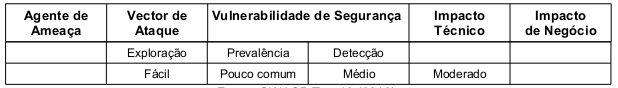

Quando a aplicação web permite que páginas privadas sejam acessadas sem a devida autenticação tanto para usuários
anônimos como para usuário autenticados, então ela é vulnerável à falhas na restrições de acesso a URL's.
Aplicações que validam privilégios apenas no lado cliente também estão, igualmente, vulneráveis. Normalmente, o
desenvolvedor, por inexperiência, acredita que a única proteção para uma URL é não mostrar o link para usuários não
autorizados. No entanto um usuário hábil, motivado ou apenas um atacante com sorte pode ser capaz de descobrir essas
páginas, executar funções e visualizar dados. Tal falha permite aos atacantes acessarem funcionalidades não autorizadas.
Funções de administração são o alvo chave neste tipo de ataque.

A proteção da URL é gerida tanto pelo código fonte como pela configuração do servidor web na qual a aplicação esta
instalada (no caso do PHP o servidor é o Apache). A vulnerabilidade pelo código fonte ocorre quando os desenvolvedores não
efetuam validações apropriadas e a vulnerabilidade pela configuração ocorre quando o servidor encontra-se mal
configurado e/ou os componentes estão desatualizados. A tabela abaixo sintetiza a classificação do risco.



A melhor forma de saber se uma aplicação falha na restrição de acesso a uma URL consiste em verificar todas as páginas.
É preciso observar a existência de autenticação e autorização. Scanners de vulnerabilidades encontram dificuldade em
identificar quais são as páginas (URL's) vulneráveis, por tanto a detecção é classificada como nível médio.

A abordagem mais eficiente e precisa está em utilizar a combinação da revisão do código fonte e dos teste de segurança
para verificar os mecanismos de controles de acesso. A verificação se torna mais eficiente se o mecanismo for
desenvolvido de forma centralizada. Quando o mecanismo é implementado de forma distribuída a verificação pode se
tornar dispendiosa.


Exemplo de sistema aplicação vulnerável
---

O principal método de ataque é chamado de "navegação forçada" (forced browsing), na qual envolve técnicas de adivinhação
de links ("guessing") e força bruta (brute force) para achar páginas desprotegidas. O atacante pode forçar a navegação
das URL ́s alvo. As URL's listadas no código abaixo exemplificam áreas do sistema que requerem autenticação.

    http://sistemavulneravil.com/app/getAppInfo
    http://sistemavulneravil.com/app/admin_getAppifo

As áreas  (pastas) listas abaixo são exemplos de pastas do Sistema Operacional Linux. São muito conhecidas e
por essa razão podem ser alvos fáceis.

    /system/
    /password
    /logs/
    /admin/
    /test/

Este tipo de ataque também é conhecido como "path transversal", ele ataca as pastas do sistema operacional através do
sistema web vulnerável. O código seguinte exemplifica um sistema vulnerável. A linha 02 armazena na variável `$template`
o valor referente ao templete padrão `blue.php`. A linha 03 e 04 recebe os dados do cookie `template`, parâmetro este,
acessível ao usuário e que pode ser manipulado pelo atacante. A linha 05 expressa a vulnerabilidade, ela concatena o
valor do parâmetro (malicioso) e busca o arquivo no disco rígido.

```php
<?php

$template = 'blue.php';

if (  isset($_COOKIE['template'])  ){

    $template = $_COOKIE['template'];
    include ( "/home/users/phpguru/templates/" . $template );

}

?>
```

O atacante poderia forjar a requisição conforme ilustrado abaixo.

    GET /vulnerable.php HTTP/1.0
    Cookie: TEMPLATE=../../../../../../../../../etc/passwd

Neste caso, o servidor da aplicação geraria a seguinte informação:

    HTTP/1.0 200 OK
    Content-Type: text/html
    Server: Apache

    root:fi3sED95ibqR6:0:1:System Operator:/:/bin/ksh
    daemon:*:1:1::/tmp:
    phpguru:f8fk3j1OIf31.:182:100:Developer:/home/users/phpguru/:/bin/csh


As seguintes funções do PHP merecem atenção especial, quando for realizada a revisão do código: `include()`,
`include_once()`, `require()`, `require_once()`, `fopen()` e `readfile()`.

Ouro exemplo de aplicação vulnerável é quando URLS "escondidos" e "especiais" são mostrados na camada de aplicação
apenas para administradores e usuários privilegiados, porém acessível a todos os usuários que tenham conhecimento da URL.

Mais um exemplo é quando a aplicação permite acesso a arquivos "escondidos" como, por exemplo arquivos de configuração
(`.ini` ou `.inc`) confiando toda segurança na obscuridade.


Prevenção
---


A prevenção contra esta vulnerabilidade requer a seleção de uma abordagem que permita solicitar a autenticação adequada
em cada página do sistema. O OWASP Top 10 (2010) sugere as seguintes recomendações:

* As políticas de autenticação e autorização devem ser baseadas em papéis/perfis minimizando, dessa forma, esforços de
manutenção dos mesmo. Implementar perfis de acesso é criar papéis que podem ser associados aos usuários, dessa forma a
configuração se faz no perfil e não em cada usuário o que torna o trabalho de permissão e restrição de acesso mais
preciso e menos penoso. Como exemplo um sistema pode ter dois perfis de acesso: "administradores" e "básicos", esses
papéis são associados aos usuários e podem, inclusive, ser utilizados para um grupo de usuários.

* O mecanismo de controle de acesso deve proteger todas as URL ́s do sistema web verificando as funções e direitos do
usuário antes que qualquer processamento ocorra. Para pulverizar o mecanismo de controle o mesmo deve ser de fácil
implementação. O código abaixo demonstra um exemplo de implementação.

```php
<?php
try{
    $ESAPI->accessController()->assertAuthorized("businessFunction", runtimeData);
    //a aplicação segue se curso normalmente
    if ( $ESAPI->accessController()->isAuthorized("businessFunction", runtimeData) )
        echo "<a href=\"/doAdminFunction\">ADMIN</a>";
    else
        echo "<a href=\"/doNormalFunction\">NORMAL</a>";

} catch ($ESAPI->AccessControlException) {
      // um ataque pode estar acontecendo
}
?>
```

* As política de autenticação não devem ser codificadas diretamente nas aplicações o que a tornaria pouco flexível.
Deve-se evitar o uso distribuído das políticas, tal prática aumenta a complexidade da programação e probabilidade de
ocorrência de erros. As páginas podem (devido ao erro) não serem validadas, deixando a aplicação vulnerável. É
preferível utilizar os recursos provenientes da programação orientada a objeto (OOP) e também fazer uso da do padrão
MVC (model, view e controller)que resulta na separação da lógica da aplicação. Essas técnicas auxiliam na organização do
código fonte elevando sua manutenibilidade e facilidade de revisão.

* A aplicação, por defeito, deve negar todos os acessos e requerer atribuições explicitas e adequadas para acessar
qualquer página do sistema.

* O processo de verificação deve ser realizado em todos os passos do fluxo e não apenas no passo inicial, pois não é
suficiente verificar uma vez o usuário autorizado e não verificar novamente nos passos seguintes. Um atacante pode
simplesmente burlar o passo onde a autorização é verificada e forjar o valor do parâmetro necessário e continuar no passo
seguinte.

* Realizar teste de invasão (penetration test) antes do código entrar em produção.

* Observar arquivos de includes/bibliotecas, eles devem ser mantidos, sempre que possível, fora da raiz da aplicação
web (document root).

* Proteção por obscuridade não é suficiente para proteger dados e funções sensíveis, não suponha que as URL's estarão
fora do alcance do atacante. Assegure-se que ações com privilégios altos e administrativos estejam protegidos.

* Bloquear acesso a todos os tipos de arquivos que não sejam do tipo executável(.php). Este filtro deve seguir a
abordagem "accept know good" . Arquivos com extensões `.xml`, `.ini`, `.txt`,  arquivos de log e outros não devem ser
executados diretamente. Essa proteção se faz através da utilização do arquivo `.htaccess`. O código abaixo exemplifica
uma restrição aos tipos de arquivos citados.

```PowerShell
# www/.htaccess
ReswriteEngine On
# RewriteBase/
RewriteRule !\,(js|ico|txt|gif|jpg|png|css)$index.php
```

* Manter o antivírus atualizado e as correções de segurança principalmente para os componentes que manipulam arquivos
fornecidos por usuários.
