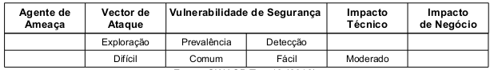
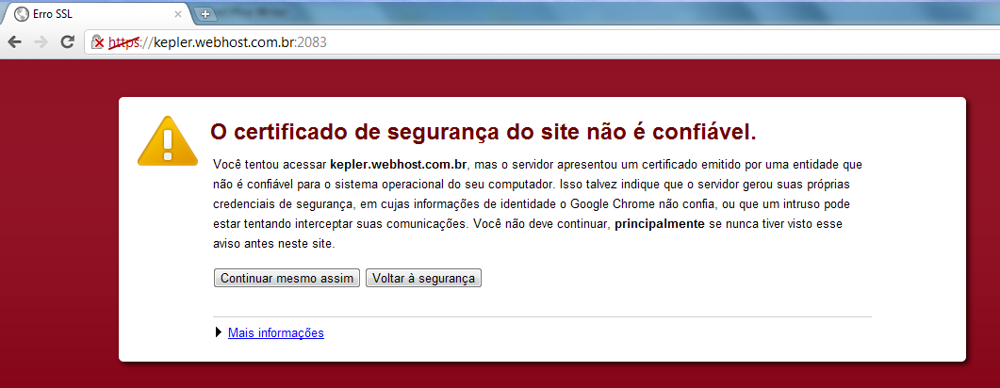

Esta vulnerabilidade está mais relacionada com as configurações do servidor no qual a aplicação web está instalada do
que com a aplicação em si. Servidores Web que não protegem o tráfego de rede são suscetíveis a esta vulnerabilidade.
Servidores que utilizam o protocolo SSL (Secure Sockets Layer) ou o protocolo TLS (Transport Layer Security) em partes 
específicas, como a autenticação, e não o utilizam para as demais partes também estão, igualmente, vulneráveis. Eles 
expõem dados sensíveis e identificadores de sessão à interceptação. Servidores com certificados mal configurados também
estão vulneráveis.


Monitoramento do tráfego da rede é realizada através de um sniffer (ferramenta que é capaz de interceptar e registrar o 
tráfego da rede), o que facilita a sucesso no ataque, porém a exploração é considerada como sendo de nível difícil. 
A dificuldade reside em monitorar o tráfego no exato momento em que os usuários acessam o sistema web. O impacto técnico
é considerado moderado, esta vulnerabilidade pode facilitar ataques de phishing e originar roubos de contas de acesso. 
Se uma conta de administrador for comprometida toda aplicação estará exposta. A tabela abaixo sintetiza a classificação
do risco:



Para detectar as falhas basta monitorar o tráfego de rede da aplicação. Falhas mais sutis requerem inspeção da 
arquitetura da aplicação e da configuração do servidor. Ferramentas automatizadas, comumente, localizam muitas falhas
relacionadas ao protocolo SSL mas dificilmente localizarão falhas nas conexões de back-end. Abordagem manual também pode
localizar falhas relacionadas ao protocolo SSL na interface, entretanto as ferramentas automatizadas são mais eficientes.
Para localizar falha nas conexões de back-end a abordagem manual é a mais indicada. (OWASP Top 10; 2010)


Exemplo de aplicação vulnerável
---


A aplicação web não utiliza o protocolo SSL em nenhuma das suas páginas. O atacante monitora o tráfego de rede, como 
por exemplo, uma rede sem fios aberta ou a rede de cabo do seus vizinho, e observa o cookie de sessão de uma vítima
autenticada. O atacante utiliza a informação deste cookie e rouba a sessão do utilizador legítimo.

Outro exemplo de aplicação vulnerável é quando o sistema possui um certificado digital mal configurado que causa avisos
de alerta no navegador do usuário, conforme nos mostra a figura 04. Os usuários, tendo que aceitar os avisos para
poderem continuar o fluxo da aplicação, acabam por se habituarem a tais avisos. Ataques do tipo phishing à aplicação 
poderão enganar os usuários a acessar um servidor semelhante, que não possui certificado, construindo avisos de alerta
semelhantes. A vítima, estando acostumada com o alerta, procederá normalmente fornecendo senhas ou outros dados privados
utilizando, por fim, um servidor malicioso.




Prevenção
---

A prevenção primaria referente a camada de transporte poderá ser feita através das recomendações do OWASP Top 10 (2010):

* Solicitar SSL para todas as páginas sensíveis. Pedidos não-SSL para estas páginas deverão  ser redirecionados para a página SSL.
* Colocar a opção "secure" em todos os cookies sensíveis. A função setcookie criar um cookie caso nenhuma saída tenha 
  sido enviada para o navegador. O quinto parâmetro da função aceita um valor booleano e por padrão é false. Quando o 
  valor desse parâmetro for `true`, a opção "secure" será ativada, isto é, o cookie só poderá ser transmitido sob uma 
  conexão segura HTTPS do cliente. O código abaixo ilustra a utilização da opção "secure".

```php
<?php
setcookie("nome_do_cookie", $valor, $tempo_experiar, $dominio, true);
```

* Configurar o fornecedor SSL para suportar apenas algoritmos robustos, preferencialmente os compatíveis com a FIPS 140-2
* Assegurar que o certificado é válido, não expirado, não revogado e que mapeia todos domínios utilizados pelo site web.
* Demais ligações de back-end, do lado do servidor, também devem utilizar SSL.


