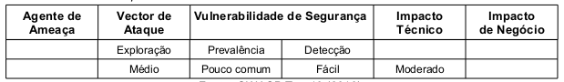

Quando um atacante, por meio de engenharia social, ilude a vítima conseguindo que esta acesse uma URL que redireciona,
indevidamente, a vítima para um site malicioso, permitindo, dessa forma, o ataque do tipo Phishing ou, até mesmo, que
um malware seja instalado no computador da vítima. O redirecionamento pode ser interno (dentro da aplicação) como
externo (apontando para fora da aplicação, outro domínio). A tabela abaixo sintetiza a classificação do risco.



Para fazer com que a vítima acesse a URL maliciosa o atacante utiliza-se de engenharia social. Ele escolhe a empresa com
um sistema web que contém a vulnerabilidade, reproduz um e-mail que será enviado para várias endereços eletrônico com a
URL maliciosa. A mensagem deste e-mail ilude a vítima pedindo, por exemplo, que ela "acesse o link para liberar novo
módulo de segurança para acesso a conta corrente". Costumam ser mensagens que induzem a vítima a uma ação imediata,
fazendo-a agir primeiro e pensar depois.

Para fazer com que a vítima acesse a URL maliciosa o atacante utiliza-se de engenharia social. Ele escolhe a empresa com
um sistema web que contém a vulnerabilidade, reproduz um e-mail que será enviado para várias endereços eletrônico com a
URL maliciosa. A mensagem deste e-mail ilude a vítima pedindo, por exemplo, que ela "acesse o link para liberar novo
módulo de segurança para acesso a conta corrente". Costumam ser mensagens que induzem a vítima a uma ação imediata,
fazendo-a agir primeiro e pensar depois.


Exemplo de aplicação vulnerável
---

A aplicação possui um script(página) chamado `redireciona.php` que utiliza apenas um parâmetro denominado `url_destino`.
O script tem como objetivo redirecionar o usuário para determinada página dentro ou fora da aplicação. Vejamos um exemplo
no abaixo:

```php
<?php

$ir_para_url = $_GET['url_destino'];
header("Location: $ir_para_url");

?>
```


O atacante, percebendo este detalhe, criará uma URL maliciosa apontando para um site(servidor) que, uma vez acessado,
poderá induzir à vitima a realizar operações indesejadas, conforme demonstra o código abaixo:

    http:/www.appvulneravel.com/redireciona.php?url_destino=www.craker.com


Prevenção
---

O OWASP Top 10 (2010) sugere como prevenção:

1. Evitar o uso de redirecionamentos e encaminhamentos,
2. Se usar redirecionamentos e encaminhamentos, não envolva parâmetros do utilizador no cálculo da URL de destino, e
3. Se os parâmetros de destino não podem ser evitados, tenha certeza de fornecer um valor válido e autorizado para o
utilizador. É possível fazer uso da ESAPI conforme seguinte.

```php
<?php
$ir_para_url = $_GET['url_destino'];
$ir_para_url = $ESAPI->HTTPUtilities->sendRedirect("response", request.getParameter("$ir_para_url"));
header("Location: $ir_para_url");
?>
```