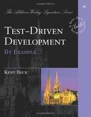

Seja bem vindo(a) a seção TDD (Test Driven Development)!
   
__TDD__ é acrônimo para __Test Driven Development__ (desenvolvimento guiado por testes)

Quer aprender TDD? Leia o livro do mestre...

Kent Bach, de longe, é o primeiro grande divulgador da técnica TDD que nada mais é do que escrever testes de unidades
antes de começarmos a codificar, isso muda tudo! **TDD está relacionado diretamente com a questão da arquitetura**. 

É preciso que o desenvolvedor tenha um bom conhecimento sobre OOP (Programação Orientada a Objetos) e também sobre 
testes unitários. Mas este site é dedicado aos iniciantes, então eu tive que simplificar muitas coisas para facilitar
e, inclusive, incentivar o aprendizado.

O primeiro artigo que abre esta seção é sobre a idéia básica do que é TDD.

Leia o primeiro artigo [Uma breve noção sobre o que é TDD](/tdd/o-que-e-tdd/)

Agora podemos partir para a prática! Aí eu caí em outro grande problema: qual linguagem usar? Por que não usar Ruby, PHP
ou qualquer outra linguagem ? Não há a melhor escolha, mas inevitavelmente, haverá uma escolha. Eu optei por Python pois 
acho a sintaxe muito simples e convidativa. E o melhor, além de vir instalado no Linux, o framework de teste também
acompanha a instalação. Para iniciar, basta digitar no console `python` e sair brincando.

### Praticando TDD na linguagem Python

Sequência de exemplos de TDD escritos nas linguagens Python. 

Todos os exemplos são muito fáceis de seguir, eles são indicados para os "iniciantes iniciando" em TDD.



